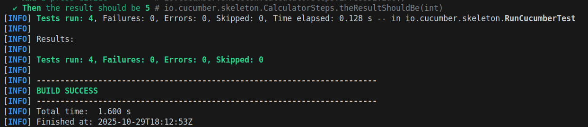
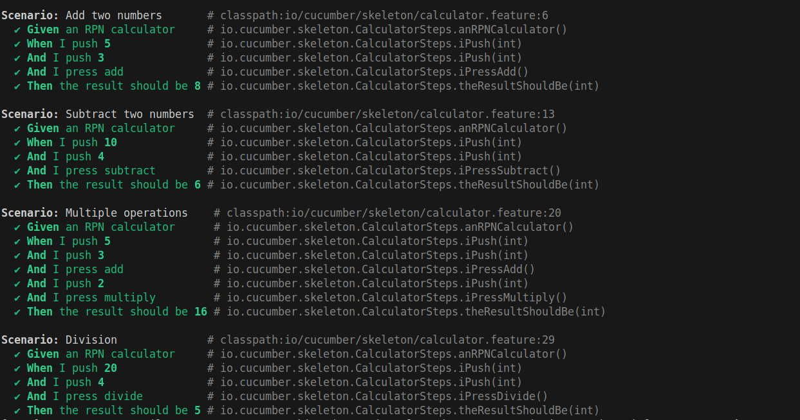
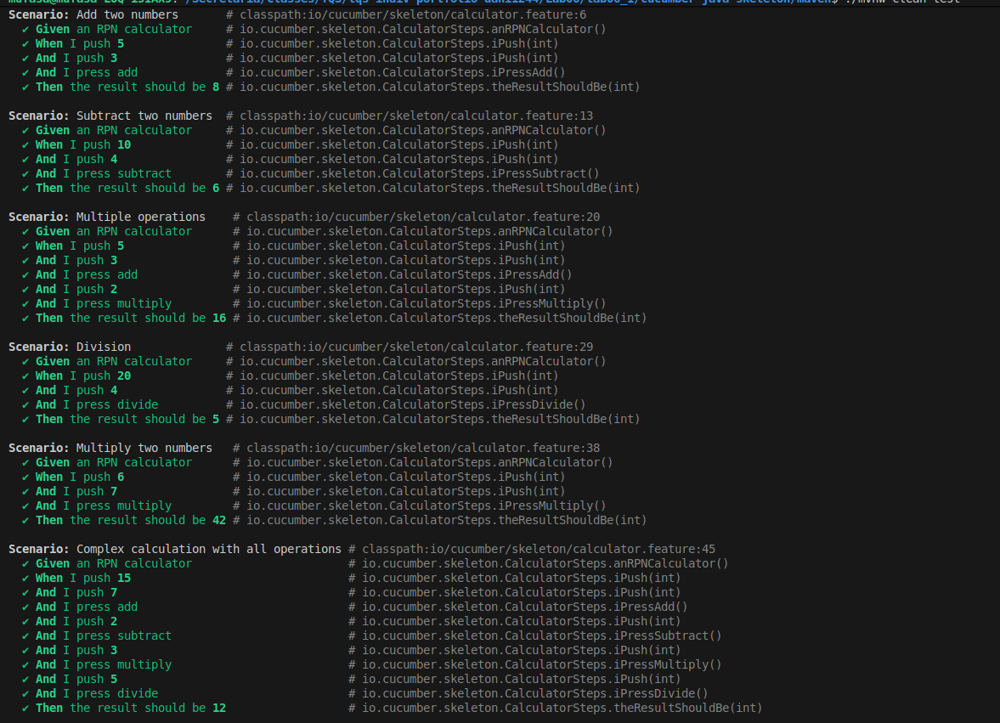
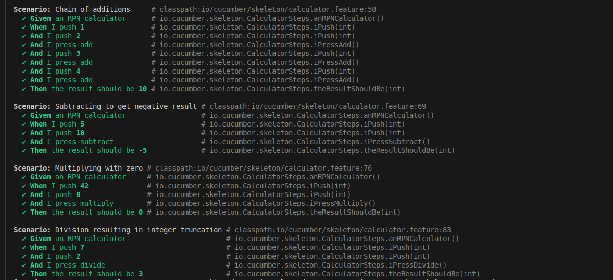
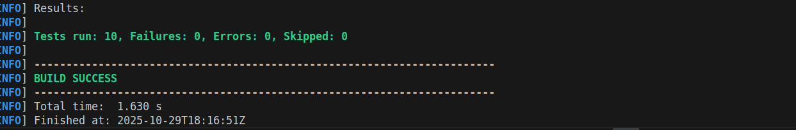

# Lab 6.1 - BDD with Cucumber: RPN Calculator

**Universidade de Aveiro**  
**Autor:** Daniel Azevedo  
**Data:** Outubro 2025

## Objetivo

Implementar testes BDD (Behavior-Driven Development) usando o framework Cucumber para uma calculadora RPN (Reverse Polish Notation). Demonstrar a criação de especificações executáveis com Gherkin DSL e a automação de cenários de teste.

**Desenvolvido em:** Java 17, Cucumber 7.31.0, JUnit 5, Maven


## Requisitos Cumpridos

### Parte a) Criar projeto Maven com Cucumber

**Opção escolhida:** Clonar repositório oficial do Cucumber
```bash
git clone https://github.com/cucumber/cucumber-java-skeleton.git
cd cucumber-java-skeleton/maven
```


**Configuração Maven (`pom.xml`):**
- Cucumber BOM: 7.31.0
- JUnit BOM: 6.0.0
- Java: 17
- Dependencies:
  - `cucumber-java` (DSL Gherkin)
  - `cucumber-junit-platform-engine` (integração JUnit 5)
  - `junit-jupiter` (assertions)
  - `junit-platform-suite` (runner)

### Parte b) Escrever ficheiro .feature

**Criado:** `calculator.feature` com cenários em Gherkin

```gherkin
Feature: RPN Calculator
  As a user of the RPN calculator
  I want to perform basic arithmetic operations
  So that I can calculate results using Reverse Polish Notation

  Scenario: Add two numbers
    Given an RPN calculator
    When I push 5
    And I push 3
    And I press add
    Then the result should be 8
```

**Total de cenários implementados:** 10

### Parte c) Implementar test steps

**Classe:** `CalculatorSteps.java`

**Step definitions usando Cucumber Expressions (não regex!):**

```java
@Given("an RPN calculator")
public void anRPNCalculator() {
    calculator = new RPNCalculator();
}

@When("I push {int}")
public void iPush(int number) {
    calculator.push(number);
}

@Then("the result should be {int}")
public void theResultShouldBe(int expectedResult) {
    assertEquals(expectedResult, calculator.getResult());
}
```

**Problema encontrado:** JUnit Jupiter não estava no `pom.xml` original

**Solução:** Adicionar dependência:
```xml
<dependency>
    <groupId>org.junit.jupiter</groupId>
    <artifactId>junit-jupiter</artifactId>
    <scope>test</scope>
</dependency>
```

### Parte d) Executar os testes

**Comando:**
```bash
./mvnw clean test
```

**Resultado:**


**Output detalhado:**


### Parte e) Adicionar mais cenários

**Cenários adicionais implementados:**




**Observação importante:** 
- **Nenhum código Java adicional foi necessário!**
- Os steps existentes foram **reutilizados** automaticamente
- Demonstra o poder da **reutilização** no BDD


## Implementação

### RPNCalculator.java

**Classe principal** que implementa calculadora Reverse Polish Notation usando `Stack<Integer>`:

```java
public class RPNCalculator {
    private Stack<Integer> stack;
    
    public void push(int number) { ... }
    public void add() { ... }
    public void subtract() { ... }
    public void multiply() { ... }
    public void divide() { ... }
    public int getResult() { ... }
}
```

**Funcionalidades:**
- Push de números para pilha
- Operações aritméticas básicas (+, -, *, /)
- Validação de operandos insuficientes
- Proteção contra divisão por zero
- Gestão de pilha vazia

### calculator.feature (Gherkin)

**Estrutura de um cenário:**
```gherkin
Scenario: [Nome descritivo]
  Given [Pré-condição]
  When [Ação]
  And [Ação adicional]
  Then [Resultado esperado]
```

**Exemplo de RPN:**
- Notação infixa: `(5 + 3) * 2`
- Notação RPN: `5 3 + 2 *`
- Resultado: `16`

### CalculatorSteps.java

**Mapeamento Gherkin → Java usando Cucumber Expressions:**

 - Given an RPN calculator  `"an RPN calculator"` javaMethodo will be: `anRPNCalculator()`
 - When I push 5 `"I push {int}"`, `iPush(int)` 
 - When I press add `"I press add"`, `iPressAdd()`
 - Then the result should be 8, `"the result should be {int}"`, `theResultShouldBe(int)`

**Vantagem:** O parâmetro `{int}` captura qualquer número automaticamente!

### RunCucumberTest.java

**Cucumber runner** usando JUnit Platform Suite:

```java
@Suite
@IncludeEngines("cucumber")
@SelectClasspathResource("io/cucumber/skeleton")
@ConfigurationParameter(
    key = PLUGIN_PROPERTY_NAME, 
    value = "pretty"
)
public class RunCucumberTest {
}
```

## Vantagens do BDD com Cucumber
 
 **Legibilidade:** Cenários compreensíveis por Product Owners, QA, Devs 
 **Traceabilidade:**  Ligação direta requisitos → features → testes
 **Reutilização:**  Steps partilhados entre cenários
 **Colaboração:**  Linguagem comum entre negócio e técnica
 **Documentação:**  Features servem como specs executáveis
 **Early feedback:**  Escrever cenários antes do código


## Resultados dos Testes

### Execução Final

```bash
./mvnw clean test
```

**Output:**



## Dependências do Projeto

```xml
<!-- Cucumber -->
<dependency>
    <groupId>io.cucumber</groupId>
    <artifactId>cucumber-java</artifactId>
    <version>7.31.0</version>
</dependency>
<dependency>
    <groupId>io.cucumber</groupId>
    <artifactId>cucumber-junit-platform-engine</artifactId>
    <version>7.31.0</version>
</dependency>

<!-- JUnit 5 -->
<dependency>
    <groupId>org.junit.jupiter</groupId>
    <artifactId>junit-jupiter</artifactId>
    <version>5.10.0</version>
</dependency>
<dependency>
    <groupId>org.junit.platform</groupId>
    <artifactId>junit-platform-suite</artifactId>
</dependency>

<!-- Assertions (optional) -->
<dependency>
    <groupId>org.assertj</groupId>
    <artifactId>assertj-core</artifactId>
    <version>3.27.6</version>
</dependency>
```


## Recursos Utilizados

- [Cucumber Official Docs](https://cucumber.io/docs/cucumber/)
- [Cucumber Expressions](https://github.com/cucumber/cucumber-expressions)
- [Gherkin Reference](https://cucumber.io/docs/gherkin/reference/)
- [BDD Guide](https://cucumber.io/docs/bdd/)
- [Cucumber School](https://school.cucumber.io/)
- [Mastering JUnit 5 - Boni García](https://github.com/bonigarcia/mastering-junit5)


## Conclusão

Este lab consolidou os fundamentos de **Behavior-Driven Development** com Cucumber:

1. Escrever **especificações executáveis** em Gherkin
2. Usar **Cucumber Expressions** (best practice moderna)
3. **Reutilizar steps** em múltiplos cenários
4. Integrar Cucumber com **JUnit 5** e **Maven**
5. Criar **Living Documentation** através de features
6. Aplicar **TDD/BDD** workflow (feature → steps → code)

**Impacto no desenvolvimento:**
- Reduz gap entre requisitos e testes
- Facilita comunicação entre stakeholders
- Documentação sempre atualizada
- Promove reutilização de código
- Testes legíveis e manuteníveis
