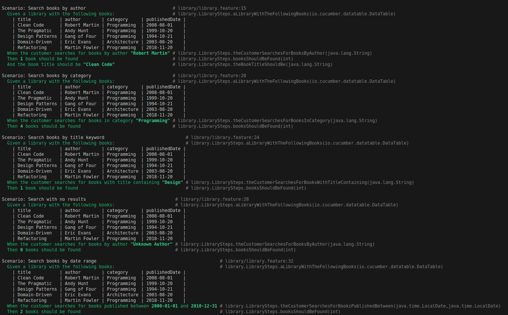
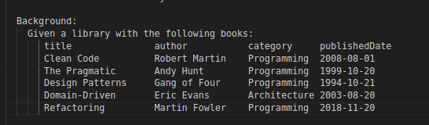
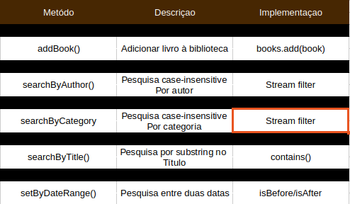
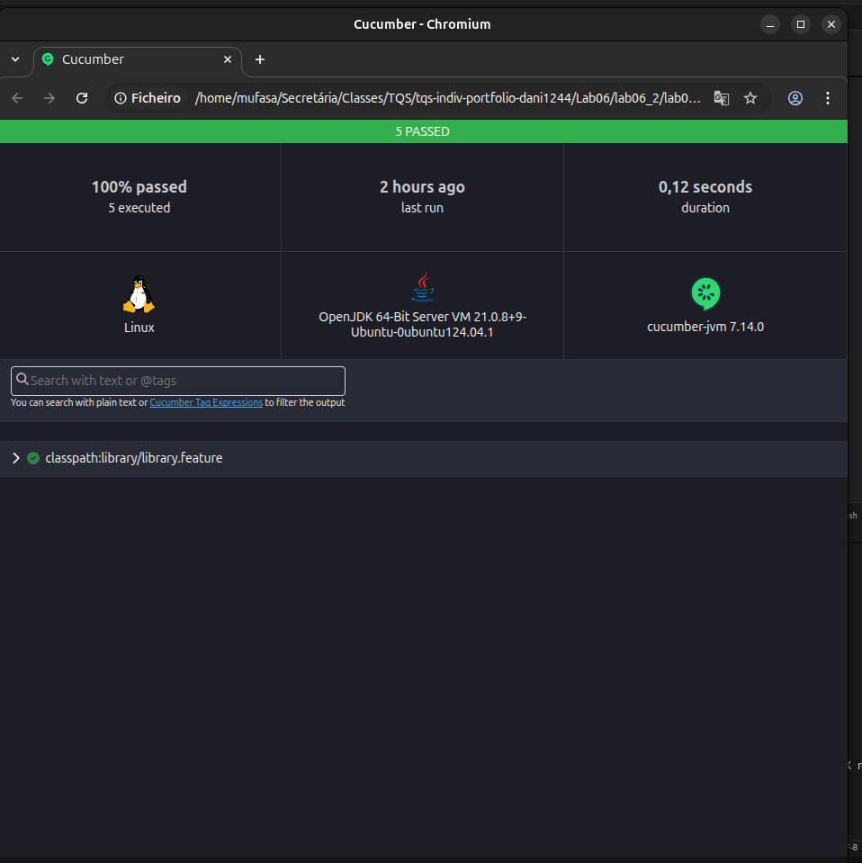

# Lab 6.2 - BDD with Cucumber: Library Management System

**Universidade de Aveiro**  
**Autor:** Daniel Simbe  
**Data:** Outubro 2025

## Objetivo

Implementar testes BDD avançados usando Cucumber com **ParameterTypes customizados** para handling de datas e **DataTables** para carregar múltiplos registos. Sistema de gestão de biblioteca com pesquisa de livros por diversos critérios.

**Desenvolvido em:** Java 17, Cucumber 7.14.0, JUnit 5, Maven

---

## Requisitos Cumpridos

### Parte a) Escrever feature para book search

**Cenários implementados:**



**Feature file criado:** `library.feature`

```gherkin
Feature: Library Book Search
  As a library user
  I want to search for books
  So that I can find books by different criteria
```

### Parte b) Incluir filtro por datas com ParameterType

**ParameterType customizado implementado:**

```java
@ParameterType("\\d{4}-\\d{2}-\\d{2}")
public LocalDate iso8601Date(String dateString) {
    return LocalDate.parse(dateString, DATE_FORMATTER);
}
```

**Uso no step definition:**
```java
@When("the customer searches for books published between {iso8601Date} and {iso8601Date}")
public void theCustomerSearchesForBooksPublishedBetween(
    LocalDate startDate, 
    LocalDate endDate
) {
    searchResults = library.searchByDateRange(startDate, endDate);
}
```

**Uso na feature:**
```gherkin
When the customer searches for books published between 2000-01-01 and 2010-12-31
```

**Vantagens:**
- **Type-safe**: Conversão automática String → LocalDate
- **Reutilizável**: Mesmo ParameterType em múltiplos steps
- **Validação**: Formato yyyy-MM-dd enforced por regex
- **Legível**: Datas naturais no Gherkin

### Parte c) Usar DataTable para carregar "database" de livros

**DataTable implementada no Background:**




**Step definition com list of maps:**

```java
@Given("a library with the following books:")
public void aLibraryWithTheFollowingBooks(DataTable dataTable) {
    library = new Library();
    
    // Acesso como list of maps com headings
    List<Map<String, String>> rows = dataTable.asMaps(String.class, String.class);
    
    for (Map<String, String> row : rows) {
        String title = row.get("title");
        String author = row.get("author");
        String category = row.get("category");
        LocalDate publishedDate = LocalDate.parse(
            row.get("publishedDate"), 
            DATE_FORMATTER
        );
        
        Book book = new Book(title, author, category, publishedDate);
        library.addBook(book);
    }
}
```

**Vantagens:**
- **Readable**: Formato tabular claro
- **Maintainable**: Fácil adicionar/remover livros
- **DRY**: Background executado antes de cada cenário
- **Type-safe**: Usa headings como chaves do Map

---

## Implementação

### Book.java - Modelo de Dados

**Classe POJO** representando um livro:

```java
public class Book {
    private String title;
    private String author;
    private String category;
    private LocalDate publishedDate;
    
    // Constructor, getters, equals, hashCode, toString
}
```

**Atributos:**
- `title` - Título do livro
- `author` - Autor do livro
- `category` - Categoria (Programming, Architecture, etc.)
- `publishedDate` - Data de publicação (LocalDate)

**Métodos importantes:**
- `equals()` / `hashCode()` - Baseados em title + author
- `toString()` - Debug-friendly representation

### Library.java - Serviço de Biblioteca

**Classe de serviço** com operações CRUD e pesquisa:

```java
public class Library {
    private List<Book> books;
    
    public void addBook(Book book) { ... }
    public List<Book> searchByAuthor(String author) { ... }
    public List<Book> searchByCategory(String category) { ... }
    public List<Book> searchByTitle(String title) { ... }
    public List<Book> searchByDateRange(LocalDate start, LocalDate end) { ... }
}
```

**Funcionalidades:**



**Exemplo de implementação com Stream API:**

```java
public List<Book> searchByAuthor(String author) {
    return books.stream()
            .filter(book -> book.getAuthor().equalsIgnoreCase(author))
            .collect(Collectors.toList());
}
```

### library.feature - Especificação Gherkin

**Estrutura completa:**

```gherkin
Feature: Library Book Search
  As a library user
  I want to search for books
  So that I can find books by different criteria

  Background:
    Given a library with the following books:
      [DataTable com 5 livros]

  Scenario: Search books by author
    When the customer searches for books by author "Robert Martin"
    Then 1 book should be found
    And the book title should be "Clean Code"
  
  [... 4 more scenarios ...]
```

**Componentes Gherkin utilizados:**
- **Feature** - Descrição de alto nível
- **Background** - Setup comum a todos os cenários
- **Scenario** - Caso de teste individual
- **Given/When/Then** - Estrutura AAA (Arrange/Act/Assert)
- **DataTable** - Dados tabulares
- **And** - Continuação de steps

### LibrarySteps.java - Step Definitions

**Classe de steps** com ParameterType e DataTable handling:

```java
public class LibrarySteps {
    private Library library;
    private List<Book> searchResults;
    
    @ParameterType("\\d{4}-\\d{2}-\\d{2}")
    public LocalDate iso8601Date(String dateString) { ... }
    
    @Given("a library with the following books:")
    public void aLibraryWithTheFollowingBooks(DataTable dataTable) { ... }
    
    @When("the customer searches for books by author {string}")
    public void theCustomerSearchesForBooksByAuthor(String author) { ... }
    
    @Then("{int} book(s) should be found")
    public void booksShouldBeFound(int expectedCount) { ... }
}
```

**Nota sobre plural/singular:**
```java
@Then("{int} book(s) should be found")
```
O `(s)` torna o "s" opcional, permitindo:
- "1 book should be found" 
- "4 books should be found" 

---

## Conceitos Aprendidos

### ParameterType vs Cucumber Expression

**Cucumber Expression padrão:**
```java
@When("I push {int}")  // {int} built-in
```

**ParameterType customizado:**
```java
@ParameterType("\\d{4}-\\d{2}-\\d{2}")
public LocalDate iso8601Date(String dateString) {
    return LocalDate.parse(dateString, DATE_FORMATTER);
}

@When("... between {iso8601Date} and {iso8601Date}")
```

**Vantagens:**
- **Type safety**: Retorna tipo correto (LocalDate)
- **Reusabilidade**: Definido uma vez, usado em múltiplos steps
- **Validation**: Regex garante formato correto
- **Maintainability**: Lógica de parsing centralizada

### DataTable: List of Maps vs List of Lists

**List of Lists (sem headings):**
```java
List<List<String>> rows = dataTable.asLists();
String title = rows.get(0).get(0);  // Índice mágico!
```

**List of Maps (com headings):**
```java
List<Map<String, String>> rows = dataTable.asMaps();
String title = row.get("title");  // Chave explícita!
```

**Por que Maps é melhor:**
- **Self-documenting**: `row.get("title")` vs `row.get(0)`
- **Ordem independente**: Pode reordenar colunas sem quebrar código
- **Legível**: Feature file serve como documentação
- **Menos erros**: Typo em chave dá erro claro

### Background vs Repetir Given em cada Scenario

**Sem Background (repetitivo):**
```gherkin
Scenario: Search by author
  Given a library with books A, B, C
  When ...

Scenario: Search by category
  Given a library with books A, B, C  # Repetido!
  When ...
```

* Com Background (DRY):**
```gherkin
Background:
  Given a library with books A, B, C

Scenario: Search by author
  When ...

Scenario: Search by category
  When ...
```

**Vantagens:**
- **DRY**: Não repete setup
- **Maintainability**: Muda uma vez, afeta todos os cenários
- **Performance**: Pode ser optimizado pelo runner
- **Legibilidade**: Foco nos cenários individuais

---


##  Dependências do Projeto

```xml
<!-- Cucumber -->
<dependency>
    <groupId>io.cucumber</groupId>
    <artifactId>cucumber-java</artifactId>
    <version>7.14.0</version>
</dependency>
<dependency>
    <groupId>io.cucumber</groupId>
    <artifactId>cucumber-junit-platform-engine</artifactId>
    <version>7.14.0</version>
</dependency>

<!-- JUnit 5 -->
<dependency>
    <groupId>org.junit.jupiter</groupId>
    <artifactId>junit-jupiter</artifactId>
    <version>5.10.0</version>
</dependency>
<dependency>
    <groupId>org.junit.platform</groupId>
    <artifactId>junit-platform-suite</artifactId>
    <version>5.10.0</version>
</dependency>
```


---


### Executar testes

```bash

# Com Maven instalado
mvn clean test
```

### Ver relatório HTML

```bash
# Abrir relatório no browser
open target/cucumber-reports.html
# ou
xdg-open target/cucumber-reports.html  # Linux
```


---


## Best Practices Aplicadas

**ParameterType para tipos customizados** - Dates como LocalDate  
**DataTable com headings** - Self-documenting tables  
**Background para setup comum** - DRY principle  
**Stream API para queries** - Código funcional e legível  
**Case-insensitive search** - Melhor UX  
**Plural handling** - `{int} book(s)` gramática correta  
**DateTimeFormatter estático** - Performance  
**Immutable results** - Retorna novas listas  
**HTML reporting** - Documentação visual  
**Clear naming** - Métodos descritivos  

---

## Recursos Usados

- [Cucumber DataTables Guide](https://cucumber.io/docs/cucumber/api/#data-tables)
- [Cucumber ParameterTypes](https://cucumber.io/docs/cucumber/cucumber-expressions/#parameter-types)
- [Background in Gherkin](https://cucumber.io/docs/gherkin/reference/#background)
- [Java 8 LocalDate Tutorial](https://www.baeldung.com/java-8-date-time-intro)
- [Stream API Guide](https://www.baeldung.com/java-8-streams)

---

## Conclusão

Este lab consolidou conceitos **avançados de BDD** com Cucumber:

**Principais aprendizagens:**
1. **ParameterType customizado** para type-safe date handling
2. **DataTable mapping** com list of maps e headings
3. **Background** para reutilização de setup entre cenários
4. **Stream API** para queries funcionais em memória
5. **Date range queries** com LocalDate
6. **Plural handling** para gramática natural

**Comparado com Lab 6.1:**
- Complexidade aumentada (dates, collections)
- Funcionalidades avançadas (ParameterType, DataTable)
- Cenários mais realistas (biblioteca vs calculadora)
- Melhor estruturação (Background, setup compartilhado)

**Impacto no desenvolvimento:**
- Especificações executáveis mais próximas do negócio
- DataTables facilitam setup de cenários complexos
- ParameterTypes tornam steps type-safe e reutilizáveis
- Background reduz duplicação e melhora manutenibilidade

---
