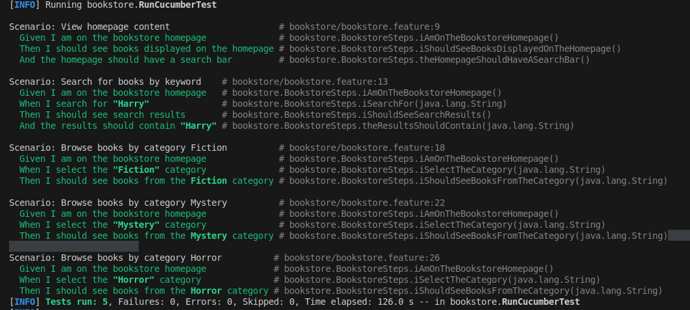
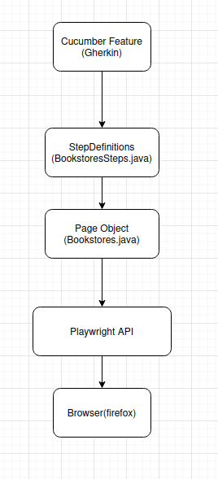

# Lab 6.3 - BDD with Cucumber: Web Automation with Playwright

**Universidade de Aveiro**  
**Autor:** Daniel Simbe 
**Data:** Outubro 2025

## Objetivo

Implementar testes de automação web usando Cucumber + Playwright para testar uma livraria online. Combinar BDD (Behavior-Driven Development) com automação de browser para criar testes expressivos e executáveis que validam funcionalidades web.

**Desenvolvido em:** Java 17, Cucumber 7.14.0, Playwright 1.40.0, JUnit 5, Maven

---

### Parte a) Desenvolver cenários para book search

**Site testado:** [Cover Bookstore](https://cover-bookstore.onrender.com)

**Cenários implementados:**



**Feature file:** `bookstore.feature`

```gherkin
Feature: Online Bookstore Search
  As a bookstore customer
  I want to search and browse books online
  So that I can find books I'm interested in

  Background:
    Given I am on the bookstore homepage

  Scenario: Search for books by keyword
    When I search for "Harry"
    Then I should see search results
    And the results should contain "Harry"
```

### Parte b) Implementar automação com Playwright

**Escolha:** Playwright(em vez de Selenium)

**Razões para escolher Playwright:**
- Mais moderno e rápido que Selenium
- Melhor API e developer experience
- Auto-waiting inteligente
- Suporte nativo para múltiplos browsers
- Screenshots e traces automáticos
- Já utilizado no Lab 5.3

**Arquitetura implementada:**



---

## Implementação

### bookstore.feature - Especificação Gherkin

**Estrutura completa:**

```gherkin
Feature: Online Bookstore Search
  
  Background:
    Given I am on the bookstore homepage

  Scenario: View homepage content
    Then I should see books displayed on the homepage
    And the homepage should have a search bar

  Scenario: Search for books by keyword
    When I search for "Harry"
    Then I should see search results
    And the results should contain "Harry"

  Scenario: Browse books by category Fiction
    When I select the "Fiction" category
    Then I should see books from the Fiction category
    
  [... mais 2 cenários de categorias ...]
```

**Características:**
- **Background** - Setup compartilhado (navegação à homepage)
- **Cenários descritivos** - Linguagem de negócio clara
- **Reutilização** - Steps partilhados entre cenários
- **Parametrização** - Categorias diferentes com mesmo step

### BookstorePage.java - Page Object Pattern

**Padrão de design:** Page Object Model (POM)

```java
public class BookstorePage {
    private final Page page;
    private static final String BASE_URL = "https://cover-bookstore.onrender.com";

    public void navigateToHomepage() { ... }
    public void searchFor(String query) { ... }
    public boolean hasSearchResults() { ... }
    public void selectCategory(String category) { ... }
    public boolean allBooksAreFromCategory(String category) { ... }
}
```

**Vantagens do Page Object:**
- **Encapsulamento** - Lógica de UI isolada
- **Reutilização** - Métodos usados em múltiplos testes
- **Manutenibilidade** - Mudanças de UI centralizadas
- **Legibilidade** - API de alto nível

**Seletores utilizados:**

```java
// Usar data-testid específico (mais robusto)
page.getByTestId("book-search-input").first()

// Usar texto visível para links/botões
page.getByText(category).first()

// Verificações genéricas de conteúdo
page.locator("body").textContent()
```

### BookstoreSteps.java - Step Definitions

**Integração Cucumber + Playwright:**

```java
public class BookstoreSteps {
    private Playwright playwright;
    private Browser browser;
    private Page page;
    private BookstorePage bookstorePage;

    @Before
    public void setUp() {
        playwright = Playwright.create();
        browser = playwright.chromium().launch(
            new BrowserType.LaunchOptions()
                .setHeadless(false)  // Ver o browser
                .setSlowMo(300)      // Slow motion
        );
        context = browser.newContext();
        page = context.newPage();
        page.setDefaultTimeout(60000);  // 60s timeout
        bookstorePage = new BookstorePage(page);
    }

    @After
    public void tearDown() {
        // Cleanup de recursos
    }
}
```

**Ciclo de vida:**
- `@Before` - Inicializa Playwright e browser **antes de cada cenário**
- `@After` - Fecha browser e liberta recursos **após cada cenário**


### RunCucumberTest.java - Test Runner

**Configuração JUnit Platform Suite:**

```java
@Suite
@IncludeEngines("cucumber")
@SelectClasspathResource("bookstore")
@ConfigurationParameter(key = GLUE_PROPERTY_NAME, value = "bookstore")
@ConfigurationParameter(key = PLUGIN_PROPERTY_NAME, 
    value = "pretty, html:target/cucumber-reports.html, json:target/cucumber-report.json")
public class RunCucumberTest {
}
```

**Relatórios gerados:**
- Console output (pretty)
- HTML report (`target/cucumber-reports.html`)
- JSON report (`target/cucumber-report.json`)

---

## Conceitos Aprendidos

### Page Object Model (POM)

**Sem POM ( má prática):**
```java
@When("I search for {string}")
public void iSearchFor(String query) {
    page.locator("input[data-testid='book-search-input']").first().fill(query);
    page.locator("input[data-testid='book-search-input']").first().press("Enter");
    page.waitForLoadState();
}
```

**Com POM (boa prática):**
```java
@When("I search for {string}")
public void iSearchFor(String query) {
    bookstorePage.searchFor(query);  // Limpo e legível!
}
```

**Benefícios:**
- Reutilização de código
- Facilita manutenção
- Testes mais legíveis
- Mudanças de UI centralizadas

### Cucumber Hooks (@Before / @After)

**@Before** - Executa **antes de cada cenário**:
- Inicializar browser
- Configurar contexto
- Setup de dados

**@After** - Executa **após cada cenário**:
- Fechar browser
- Limpar recursos
- Screenshots em caso de falha (opcional)

**Isolamento de testes:**
Cada cenário começa com browser **limpo** e **independente**.

### Playwright Auto-waiting

Playwright **espera automaticamente** por:
- Elemento estar visível
- Elemento estar enabled
- Elemento estar estável (não a mover)
- Elemento receber eventos

**Não precisa de `Thread.sleep()`!**

```java
// Playwright espera automaticamente
searchInput.fill(query);  // Espera estar visible + enabled

// Timeout customizado se necessário
page.setDefaultTimeout(60000);  // 60 segundos
```

### Seletores Robustos

**Hierarquia de preferência:**

1. **data-testid** (melhor)
   ```java
   page.getByTestId("book-search-input")
   ```

2. **Role + Name** (semântico)
   ```java
   page.getByRole(AriaRole.TEXTBOX, new Page.GetByRoleOptions().setName("Search"))
   ```

3. **Text content** (legível)
   ```java
   page.getByText("Fiction")
   ```

4. **CSS/XPath** (frágil - evitar)
   ```java
   page.locator("#search-input")  // Quebra facilmente
   ```

### Headless vs Headed Mode

**Headless mode (headless=true):**
- Mais rápido
- Ideal para CI/CD
- Não vê o que acontece

**Headed mode (headless=false):**
- Ver o browser executar
- Útil para debugging
- Melhor para desenvolvimento
- Mais lento

```java
browser = playwright.chromium().launch(
    new BrowserType.LaunchOptions()
        .setHeadless(false)  // Ver o browser!
        .setSlowMo(300)      // Slow motion
);
```

---

### Análise de Performance

 Métrica

 **Total de cenários**: 5 
 **Taxa de sucesso**: 100% (5/5)
 **Tempo total**: 2 min 7s 
 **Tempo médio/cenário**: ~25 segundos
 **Browsers instalados**  Chromium, Firefox, WebKit

**Nota:** O tempo inclui:
- Wake-up do site (render.com estava em sleep)
- Navegação entre páginas
- Slow motion (300ms) para visualização

---

## Problemas Encontrados e Soluções

### Problema 1: Site em Sleep Mode

**Erro:**
```
INCOMING HTTP REQUEST DETECTED ...
SERVICE WAKING UP ...
```

**Causa:** Site em render.com entra em sleep após inatividade

**Solução:**
```java
page.setDefaultTimeout(60000);  // Aumentar timeout para 60s
page.waitForTimeout(2000);      // Esperar após navegação
```

### Problema 2: Strict Mode Violation

**Erro:**
```
Error: strict mode violation: locator resolved to 2 elements
```

**Causa:** Site tinha 2 inputs de pesquisa duplicados (um escondido)

**Solução inicial (falhou):**
```java
page.locator("input[placeholder*='Search']").or(page.locator("input[type='text']").first())
```

**Solução final (funcionou):**
```java
page.getByTestId("book-search-input").first()  // Seletor específico + .first()
```

### Problema 3: Browsers não Instalados

**Erro:**
```
ClassNotFoundException: com.microsoft.playwright.CLI
```

**Solução:**
```bash
# Compilar projeto primeiro
mvn clean test-compile

# Depois instalar browsers
mvn exec:java -e -D exec.mainClass=com.microsoft.playwright.CLI \
    -D exec.args="install" -D exec.classpathScope=test
```

---

**Progressão de aprendizagem:**
- Lab 6.1: Fundamentos Cucumber (steps, runner, expressions)
- Lab 6.2: Conceitos avançados (ParameterType, DataTable)
- Lab 6.3: Web automation (Playwright, Page Object, Hooks)

---

## Dependências do Projeto

```xml
<!-- Cucumber -->
<dependency>
    <groupId>io.cucumber</groupId>
    <artifactId>cucumber-java</artifactId>
    <version>7.14.0</version>
</dependency>
<dependency>
    <groupId>io.cucumber</groupId>
    <artifactId>cucumber-junit-platform-engine</artifactId>
    <version>7.14.0</version>
</dependency>

<!-- JUnit 5 -->
<dependency>
    <groupId>org.junit.jupiter</groupId>
    <artifactId>junit-jupiter</artifactId>
    <version>5.10.0</version>
</dependency>
<dependency>
    <groupId>org.junit.platform</groupId>
    <artifactId>junit-platform-suite</artifactId>
    <version>5.10.0</version>
</dependency>

<!-- Playwright -->
<dependency>
    <groupId>com.microsoft.playwright</groupId>
    <artifactId>playwright</artifactId>
    <version>1.40.0</version>
</dependency>
```


### Executar Testes

```bash
# Executar todos os testes
mvn clean test

# Executar em modo headless (sem ver browser)
# Editar BookstoreSteps.java: .setHeadless(true)
mvn clean test

# Executar cenário específico
mvn test -Dcucumber.filter.tags="@search"
```

### Ver Relatórios

```bash
# Relatório HTML
open target/cucumber-reports.html
# ou
xdg-open target/cucumber-reports.html  # Linux
```

---

## Recursos Usados

- [Playwright Java Docs](https://playwright.dev/java/docs/intro)
- [Playwright Best Practices](https://playwright.dev/java/docs/best-practices)
- [Cucumber + Playwright Example](https://github.com/cucumber/cucumber-jvm/tree/main/examples/calculator-java-junit5)
- [Page Object Model Pattern](https://martinfowler.com/bliki/PageObject.html)
- [Web Testing Best Practices](https://playwright.dev/java/docs/test-best-practices)

---

## Conclusão

Este lab consolidou conceitos **avançados de BDD + Web Automation**:


1. **Integração Cucumber + Playwright** para testes E2E
2. **Page Object Model** para código manutenível
3. **Cucumber Hooks** para lifecycle management
4. **Seletores robustos** com data-testid
5. **Browser automation** com headed/headless modes
6. **Debugging** de testes web com slow motion

**Impacto no desenvolvimento:**
- Testes E2E automatizados e legíveis
- Page Object facilita manutenção
- Relatórios visuais para stakeholders
- CI/CD ready (headless mode)

---