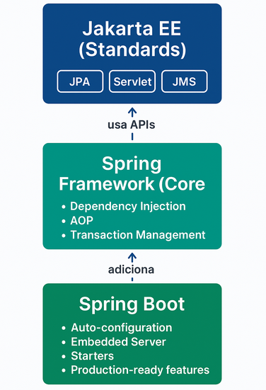

# Lab03 - 3.1 What is Spring Boot?

 
**Universidade de Aveiro**  
**Autor:** Daniel Simbe  
**Data:** Outubro 2025

---

## O que é Spring Boot?

**Spring Boot** é um framework que simplifica o desenvolvimento de aplicações Java enterprise, construído sobre o Spring Framework. A sua principal característica é a **"opinião sobre configuração"** (opinionated defaults), onde o Spring Boot permite criar aplicações Spring stand-alone, production-grade, que podem simplesmente ser executadas, assumindo configurações sensatas por padrão e requerendo configuração mínima.

Em termos práticos, Spring Boot:
- Elimina a necessidade de configuração XML complexa
- Fornece um servidor embebido (Tomcat, Jetty, Undertow)
- Oferece "starters" que agregam dependências comuns
- Permite desenvolvimento rápido com convenções inteligentes
- Facilita a criação de microservices e APIs REST

---

## 1. O que é uma "Enterprise Application"?

Uma **aplicação enterprise** é um sistema de software projetado para atender às necessidades de uma organização (empresa) em vez de utilizadores individuais. Estas aplicações caracterizam-se por:

### Características Principais:

**Escala e Performance:**
- Suportam milhares ou milhões de utilizadores simultâneos
- Processam grandes volumes de dados e transações
- Requerem alta disponibilidade (uptime de 99.9%+)

**Requisitos de Negócio:**
- Lógica de negócio complexa
- Integração com múltiplos sistemas (bases de dados, APIs, serviços externos)
- Gestão de transações distribuídas

**Aspectos Técnicos:**
- **Segurança robusta:** autenticação, autorização, encriptação
- **Concorrência:** gestão de múltiplos acessos simultâneos
- **Persistência:** armazenamento confiável de dados
- **Escalabilidade:** capacidade de crescer horizontalmente

**Exemplos:**
- Sistemas bancários (transações, contas, pagamentos)
- ERP (Enterprise Resource Planning) como SAP
- CRM (Customer Relationship Management) como Salesforce
- E-commerce de grande escala (Amazon, eBay)
- Sistemas de gestão hospitalar

---

## 2. Frameworks Líderes para "Java Enterprise Applications"

### Top 3 Frameworks (2025)

#### 1. **Spring / Spring Boot**
Em 2025, Spring Boot continua a ser o backbone das aplicações Java enterprise, especialmente em ambientes de retail e manufacturing, onde agentes AI são hospedados em infraestruturas hybrid ou multi-cloud.

**Características:**
- Framework mais popular para Java enterprise
- Ecossistema vasto (Spring Data, Spring Security, Spring Cloud)
- Comunidade ativa e documentação extensa
- Adotado por gigantes: Netflix, Amazon, Google

#### 2. **Jakarta EE (antigo Java EE)**
Jakarta EE ultrapassou Spring pela primeira vez em 2025, com 58% dos inquiridos a usar Jakarta EE comparado com 56% para Spring, marcando um marco significativo.

**Características:**
- Sucessor do Java EE (transferido para Eclipse Foundation)
- Especificação padrão da indústria
- Suportado por múltiplos vendors (IBM, Oracle, Red Hat)
- Foco em standards e portabilidade

#### 3. **Quarkus**
Framework mais recente, otimizado para:
- GraalVM e native compilation
- Containers e Kubernetes
- Startup ultra-rápido e baixo consumo de memória
- Microservices cloud-native

### Comparação Rápida:

 Framework           Vantagem Principal                 Use Case Ideal 

 **Spring Boot**    Produtividade, ecossistema          APIs REST, microservices rápidos 
 **Jakarta EE**     Standards, portabilidade            Apps enterprise tradicionais 
 **Quarkus**        Performance, cloud-native           Serverless, Kubernetes 

---

## 3. Relação Spring Boot ↔ Spring Framework ↔ Jakarta EE

### Spring Framework vs Spring Boot

**Spring Framework:**
- Framework **base** para desenvolvimento Java
- Fornece: Dependency Injection, AOP, transações, acesso a dados
- Requer **configuração manual** extensa (XML ou Java Config)
- Mais controlo, mas mais complexo

**Spring Boot:**
- Construído **sobre** o Spring Framework
- Adiciona **auto-configuração** inteligente
- Convenção sobre configuração
- Inclui servidor embebido
- Objetivo: "just run"

**Analogia:**
- Spring Framework = Motor de um carro (potente mas precisa de montagem)
- Spring Boot = Carro completo (pronto a usar)

### Spring ↔ Jakarta EE

Spring não implementa as especificações Jakarta EE por si próprio, mas integra-se com múltiplas especificações individuais e implementações que são desenvolvidas sob Jakarta EE.

**Relação:**
- **Complementares**, não competidores diretos
- Spring **usa** APIs do Jakarta EE:
  - JPA (Java Persistence API) → Spring Data JPA
  - Servlet API → Spring MVC
  - Bean Validation → Spring Validation
  - JMS (Java Message Service) → Spring JMS

O modelo de programação Spring não abraça a especificação completa da plataforma Jakarta EE; em vez disso, integra-se com especificações individuais cuidadosamente selecionadas.

**Exemplo Prático:**
```java
// Jakarta EE API (JPA)
@Entity
public class User {
    @Id
    private Long id;
}

// Spring usa a mesma API!
@Repository
public interface UserRepository extends JpaRepository<User, Long> {}
```

### Diagrama de Relação:



---

## 4. Exemplos de Configuração Automática (Defaults) do Spring Boot

Spring Boot aplica o princípio **"Convention over Configuration"**. Eis exemplos de auto-configuração:

### 4.1 Servidor Web Embebido

**Sem Spring Boot (Spring tradicional):**
```xml
<!-- Precisas configurar Tomcat manualmente -->
<dependency>
    <groupId>org.apache.tomcat.embed</groupId>
    <artifactId>tomcat-embed-core</artifactId>
</dependency>
<!-- + configurar servidor, portas, SSL, etc. -->
```

**Com Spring Boot:**
```xml
<!-- Apenas isto! -->
<dependency>
    <groupId>org.springframework.boot</groupId>
    <artifactId>spring-boot-starter-web</artifactId>
</dependency>
```
**Auto-configuração:**
- Tomcat embebido na porta 8080
- Dispatcher Servlet configurado
- JSON serialization (Jackson)
- Error handling

### 4.2 Base de Dados (JPA + H2)

**Com Spring Boot:**
```xml
<dependency>
    <groupId>org.springframework.boot</groupId>
    <artifactId>spring-boot-starter-data-jpa</artifactId>
</dependency>
<dependency>
    <groupId>com.h2database</groupId>
    <artifactId>h2</artifactId>
</dependency>
```

**Auto-configuração:**
- DataSource configurado automaticamente
- EntityManagerFactory criado
- TransactionManager configurado
- H2 in-memory database ativa
- Console H2 disponível em `/h2-console`

### 4.3 REST API

**Código:**
```java
@RestController
public class HelloController {
    @GetMapping("/hello")
    public String hello() {
        return "Hello World";
    }
}
```

**Auto-configuração:**
- HTTP Message Converters (JSON/XML)
- Exception handling
- Content negotiation
- CORS configuration (básica)

### 4.4 Actuator (Production-ready features)

```xml
<dependency>
    <groupId>org.springframework.boot</groupId>
    <artifactId>spring-boot-starter-actuator</artifactId>
</dependency>
```

**Auto-configuração:**
- `/actuator/health` - health check
- `/actuator/metrics` - métricas da aplicação
- `/actuator/info` - informação da app
- Monitoring e observability

### 4.5 Security

```xml
<dependency>
    <groupId>org.springframework.boot</groupId>
    <artifactId>spring-boot-starter-security</artifactId>
</dependency>
```

**Auto-configuração:**
- Todos os endpoints protegidos por padrão
- Form-based login
- HTTP Basic authentication
- Password gerada no log: `Using generated security password: ...`

### Tabela Resumo:

 Starter                         Auto-Configuração              Default       
 
 `spring-boot-starter-web`       Tomcat, Spring MVC, Jackson    Porta 8080    
 `spring-boot-starter-data-jpa`  JPA, Hibernate, DataSource     H2 in-memory  
 `spring-boot-starter-security`  Authentication, Authorization  Form login    
 `spring-boot-starter-test`      JUnit, Mockito, AssertJ        Test runner  
 `spring-boot-starter-actuator`  Health checks, Metrics         `/actuator/*` 


### Como Spring Boot Decide?

```java
// Spring Boot verifica se classes estão no classpath
@ConditionalOnClass(DataSource.class)
@ConditionalOnMissingBean(DataSource.class)
public DataSource dataSource() {
    // Cria DataSource automaticamente
}
```

**Princípios:**
1. **Classpath Detection:** Se encontra classe X, assume que queres usar X
2. **Conditional Configuration:** Só configura se ainda não foi configurado
3. **Sensible Defaults:** Usa valores que funcionam em 80% dos casos
4. **Easy Override:** Podes sempre sobrescrever via `application.properties`

---

