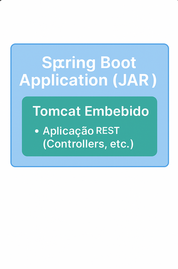
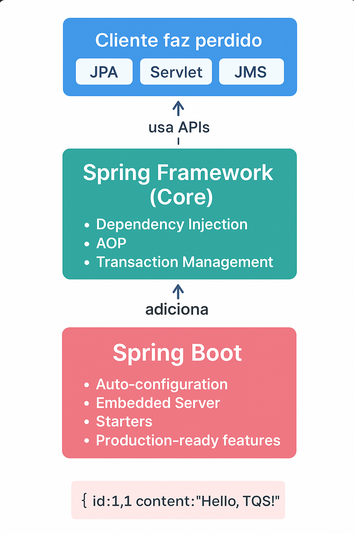

# Lab03 - 3.2 Getting Started Tutorial: REST Web Services


**Universidade de Aveiro**  
**Autor:** Daniel Simbe  
**Data:** Outubro 2025

## b) Explicação das referências ao "Tomcat" nos logs

### Output observado no console:

```
2025-10-09 01:56:12  INFO  o.s.b.w.embedded.tomcat.TomcatWebServer  : Tomcat initialized with port 8080 (http)
2025-10-09 01:56:12  INFO  o.apache.catalina.core.StandardService   : Starting service [Tomcat]
2025-10-09 01:56:12  INFO  o.apache.catalina.core.StandardEngine    : Starting Servlet engine: [Apache Tomcat/10.1.28]
```

---

## O que é o Tomcat?

**Apache Tomcat** é um **servidor web e container de servlets** open-source desenvolvido pela Apache Software Foundation. Funciona como:

1. **Servidor HTTP** - capaz de receber e responder a pedidos HTTP
2. **Container de Servlets** - implementa as especificações Java Servlet e JavaServer Pages (JSP)
3. **Application Server** (lightweight) - executa aplicações web Java

### Componentes principais visíveis nos logs:

- **`TomcatWebServer`**: Wrapper do Spring Boot para gerir o Tomcat embebido
- **`StandardService`**: Serviço que contém um ou mais Connectors (portas)
- **`StandardEngine`** (Catalina): Motor de processamento de servlets do Tomcat

---

## Por que é usado neste contexto?

### 1. **Servidor Embebido (Embedded Server)**

Tradicionalmente, aplicações Java web precisavam ser:
1. Empacotadas num ficheiro WAR (Web Application Archive)
2. Implantadas (deployed) num servidor Tomcat externo
3. O Tomcat externo tinha que ser instalado e configurado separadamente

**Com Spring Boot:**


**Vantagens:**
-  **Sem instalação externa**: Tomcat vem embutido no JAR
-  **Self-contained**: `java -jar app.jar` e pronto!
-  **Portabilidade**: Mesma app funciona em qualquer máquina com Java
-  **Microservices-friendly**: Cada serviço tem o seu próprio servidor
-  **Desenvolvimento rápido**: `mvn spring-boot:run` e está a funcionar

### 2. **Auto-configuração do Spring Boot**

Quando incluímos `spring-boot-starter-web` no `pom.xml`:

```xml
<dependency>
    <groupId>org.springframework.boot</groupId>
    <artifactId>spring-boot-starter-web</artifactId>
</dependency>
```

Spring Boot **automaticamente**:
1. Detecta Tomcat no classpath (incluído no starter-web)
2. Configura e inicia Tomcat embebido
3. Regista os Controllers como Servlets
4. Configura porta (default: 8080)
5. Configura JSON serialization (Jackson)

**Sem necessidade de:**
- Ficheiros XML de configuração (web.xml, server.xml)
- Instalação manual do Tomcat
- Configuração de connectors, thread pools, etc.

### 3. **Por que Tomcat especificamente?**

Spring Boot suporta vários servidores embebidos:
- **Tomcat** (padrão) - mais popular, maduro
- **Jetty** - mais leve, usado em ambientes embedded
- **Undertow** - mais rápido, melhor performance

Tomcat é o **padrão** porque:
- Amplamente testado e confiável
- Grande comunidade e documentação
- Compatível com todas as specs Servlet
- Usado pela maioria das empresas

### 4. **Análise dos logs**

```
INFO o.s.b.w.embedded.tomcat.TomcatWebServer : Tomcat initialized with port 8080 (http)
```
- Spring Boot inicializa Tomcat embebido
- Configurado para escutar na **porta 8080**
- Protocolo **HTTP** (não HTTPS neste caso)

```
INFO o.apache.catalina.core.StandardService : Starting service [Tomcat]
```
- **Catalina** é o nome interno do servlet engine do Tomcat
- Serviço está a ser iniciado

```
INFO o.apache.catalina.core.StandardEngine : Starting Servlet engine: [Apache Tomcat/10.1.28]
```
- Versão específica do Tomcat: **10.1.28**
- Motor de servlets está pronto para processar pedidos

---

## Fluxo de um pedido HTTP



---

## Comparação: Com e Sem Spring Boot

### Sem Spring Boot (Traditional Java EE):

```bash
# 1. Instalar Tomcat
sudo apt install tomcat9

# 2. Configurar server.xml, web.xml, context.xml

# 3. Build WAR
mvn package

# 4. Deploy no Tomcat
cp target/app.war /var/lib/tomcat9/webapps/

# 5. Restart Tomcat
sudo systemctl restart tomcat9

# 6. Acessar
http://localhost:8080/app/greeting
```

### Com Spring Boot:

```bash
# 1. Build
mvn package

# 2. Run
java -jar target/rest-service-0.0.1-SNAPSHOT.jar

# OU simplesmente
mvn spring-boot:run

# 3. Acessar
http://localhost:8080/greeting
```

**Diferença:** De ~6 passos complexos para **1 comando**! 

---

## Personalizar Tomcat (se necessário)

### Via application.properties:

```properties
# Mudar porta
server.port=9090

# Timeout de conexão
server.tomcat.connection-timeout=20000

# Threads máximos
server.tomcat.threads.max=200

# Contexto da aplicação
server.servlet.context-path=/api
```

### Via código (TomcatServletWebServerFactory):

```java
@Bean
public WebServerFactoryCustomizer<TomcatServletWebServerFactory> tomcatCustomizer() {
    return factory -> {
        factory.setPort(9090);
        factory.addConnectorCustomizers(connector -> {
            connector.setMaxPostSize(10485760); // 10MB
        });
    };
}
```


---

## Evidência de Funcionamento

### Pedido básico:
```bash
$ curl http://localhost:8080/greeting
{"id":1,"content":"Hello, World!"}
```

### Pedido com parâmetro:
```bash
$ curl http://localhost:8080/greeting?name=TQS
{"id":2,"content":"Hello, TQS!"}
```


---

## Conclusão

Tomcat aparece nos logs porque é o **servidor web embebido** que Spring Boot usa automaticamente quando detecta `spring-boot-starter-web` no classpath. Ele:

1. **Recebe pedidos HTTP** na porta 8080
2. **Encaminha para o Spring MVC** (DispatcherServlet)
3. **Processa através dos Controllers** (@RestController)
4. **Retorna respostas HTTP** (JSON via Jackson)

Tudo isto acontece **automaticamente**, sem configuração manual, graças à **auto-configuração** do Spring Boot!

---

