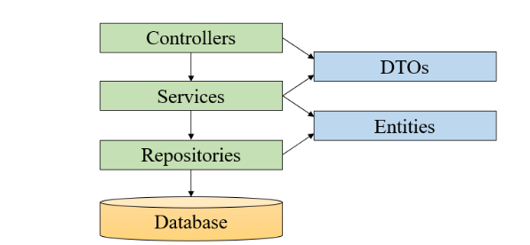

# Lab03 - 3.3 User Management Example

**Universidade de Aveiro**
**Autor:** Daniel Simbe
**Data:** Outubro 2025

---

##  Objetivo

Explorar a estrutura e funcionamento de uma aplicação **Spring Boot** que implementa uma **API RESTful** para gestão de utilizadores, analisando a arquitetura por camadas, o funcionamento dos controladores REST, a integração com o **Spring Data JPA** e o uso de uma base de dados **H2 em memória**.

---

##  Estrutura do Projeto

O projeto segue uma arquitetura em **camadas** (Layered Architecture), organizada nos seguintes pacotes:


 Camada        Responsabilidade                             Exemplos de Classes      

 **data**      Representação e acesso a dados persistentes  `User`, `UserRepository` 
 **services**  Lógica de negócio e regras de aplicação      `UserServiceImpl`        
 **boundary**  Exposição da API REST                        `UserRestController`     

---

##  Relação entre Classes

 Classe                Função                                         Anotações principais                         

 `User`                Entidade persistente (tabela `USER`)           `@Entity`                                    
 `UserRepository`      Interface JPA para CRUD automático             `@Repository`                                
 `UserServiceImpl`     Lógica de negócio, interage com o repositório  `@Service`                                   
 `UserRestController`  Define os endpoints da API                     `@RestController`, `@RequestMapping("/api")` 

### Diagrama simplificado:



---

##  Execução e Testes da API

### 1 Iniciar a aplicação

```bash
mvn spring-boot:run
```

### 2 Criar um utilizador

```bash
curl -X POST http://localhost:8080/api/users \
  -H "Content-Type: application/json" \
  -d '{"username":"alice","name":"Alice","email":"alice@example.com","password":"1234"}'
```

### 3 Consultar todos os utilizadores

```bash
curl http://localhost:8080/api/users
```

### 4 Consultar um utilizador específico

```bash
curl http://localhost:8080/api/users/1
```

### 5 Apagar um utilizador

```bash
curl -X DELETE http://localhost:8080/api/users/1
```

---

##  Dependências e Starters

O ficheiro `pom.xml` inclui os seguintes **Spring Boot Starters**:

 Starter                           Componentes incluídos        Função principal                   

 `spring-boot-starter-web`         Tomcat, Spring MVC, Jackson  Servidor HTTP e controladores REST 
 `spring-boot-starter-data-jpa`    Hibernate, JPA               Persistência de dados              
 `spring-boot-starter-validation`  Jakarta Validation           Validação de entidades             
 `spring-boot-starter-test`        JUnit, Mockito, AssertJ      Testes unitários e integração      

---

##  Análise das dependências do Spring Data JPA

```bash
mvn dependency:tree -Dincludes=org.springframework.boot:spring-boot-starter-data-jpa
```

 Inclui `spring-data-jpa` e `hibernate-core`.

```bash
mvn dependency:tree | grep -i hibernate
```

 Mostra:

```
org.hibernate.orm:hibernate-core:6.4.1.Final
org.hibernate.validator:hibernate-validator:8.0.1.Final
```

 Componente                Descrição                        Exemplo           

 **API Spring Data**       Abstração de repositórios JPA    `spring-data-jpa` 
 **Implementação JPA**     ORM (Object Relational Mapping)  `hibernate-core`  
 **Base de dados padrão**  Banco de dados em memória        `H2 Database`     

---

## Base de Dados (H2)

Mesmo sem configuração explícita no ficheiro `application.properties`, a aplicação utiliza o **H2** (em memória), inicializado automaticamente pelo Spring Boot.

### Ativar o console do H2:

```properties
spring.h2.console.enabled=true
spring.h2.console.path=/h2-console
```

### Aceder via navegador:

```
http://localhost:8080/h2-console
```

**Credenciais padrão:**

```
JDBC URL: jdbc:h2:mem:testdb
User: sa
Password: (vazio)
```

---

##  Evidência de Funcionamento

### Criar utilizador:

```bash
curl -X POST http://localhost:8080/api/users \
  -H "Content-Type: application/json" \
  -d '{"username":"alice","name":"Alice Doe","email":"alice@example.com","password":"12345"}'
```

### Resposta:

```json
{
  "id": 1,
  "username": "bob",
  "name": "Bob",
  "email": "bob@example.com",
  "password": "123"
}
```

### Listar utilizadores:

```bash
curl http://localhost:8080/api/users
[
  {
    "id": 1,
    "username": "bob",
    "name": "Bob",
    "email": "bob@example.com"
  }
]
```

---

##  Conclusão

O exercício **User Management Example** permitiu compreender como o **Spring Boot**:

1. Estrutura aplicações em camadas bem definidas;
2. Usa **anotações** (`@Entity`, `@Repository`, `@Service`, `@RestController`) para auto-configuração;
3. Integra **JPA + Hibernate** de forma automática via `spring-boot-starter-data-jpa`;
4. Persiste dados numa **base de dados H2 em memória**, sem configuração manual;
5. Expõe uma **API REST funcional** com CRUD completo para utilizadores.

---

