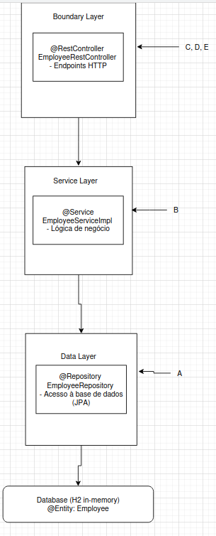
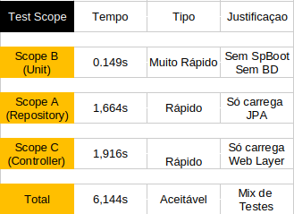
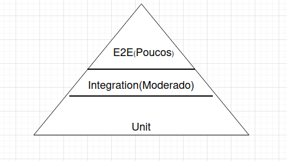

# Lab04 - 4.1 Employee Management (Getting Started Example)


**Universidade de Aveiro**  
**Autor:** Daniel Simbe 
**Data:** Outubro 2025

---


## Objetivo

Este exercício explora diferentes **estratégias de teste** numa aplicação Spring Boot multi-camadas (Employee Management System), focando em:

- **Test Slicing:** Limitar o contexto de teste apenas aos componentes necessários
- **Test Performance:** Testes mais rápidos usando mocks e contextos limitados
- **Test Isolation:** Testar cada camada independentemente
- **Integration Tests:** Validar a integração entre todas as camadas

---

## Estrutura da Aplicação

A aplicação segue a arquitetura Spring Boot típica em 3 camadas:


### Classes Principais:

#### 1. **Employee** (Entity)
```java
@Entity
@Table(name = "tqs_employee")
public class Employee {
    @Id
    @GeneratedValue(strategy = GenerationType.AUTO)
    private Long id;
    
    @Column(length = 60)
    private String name;
    
    @NotNull
    private String email;
    
    // getters, setters, constructors
}
```

#### 2. **EmployeeRepository** (Data Layer)
```java
@Repository
public interface EmployeeRepository extends JpaRepository<Employee, Long> {
    Employee findByName(String name);
    List<Employee> findByEmailContaining(String email);
}
```

#### 3. **EmployeeService** (Business Logic)
```java
public interface EmployeeService {
    Employee save(Employee employee);
    List<Employee> getAllEmployees();
    Employee getEmployeeById(Long id);
    Employee getEmployeeByName(String name);
    boolean exists(String email);
}
```

#### 4. **EmployeeRestController** (REST API)
```java
@RestController
@RequestMapping("/api")
public class EmployeeRestController {
    
    @Autowired
    private EmployeeService employeeService;
    
    @PostMapping("/employees")
    public ResponseEntity<Employee> createEmployee(@Valid @RequestBody Employee emp) {
        // ...
    }
    
    @GetMapping("/employees")
    public List<Employee> getAllEmployees() {
        // ...
    }
}
```

---

## Tipos de Testes Implementados

### Resumo dos Test Scopes


---

## Análise dos Test Scopes

### Scope A: Repository Tests (`@DataJpaTest`)

**Objetivo:** Verificar operações de acesso a dados (CRUD, queries customizadas)

**Estratégia:**
- Usa `@DataJpaTest` que:
  - Carrega **apenas** componentes JPA (Repository, EntityManager)
  - **NÃO** carrega `@Service`, `@Controller`
  - Configura automaticamente base de dados H2 in-memory
  - Cada teste roda numa transação que faz rollback

**Exemplo de teste:**
```java
@DataJpaTest
class ScopeAEmployeeRepositoryTest {
    
    @Autowired
    private TestEntityManager entityManager;
    
    @Autowired
    private EmployeeRepository employeeRepository;
    
    @Test
    void whenFindByName_thenReturnEmployee() {
        // Arrange - Inserir diretamente na BD (sem cache)
        Employee emp = new Employee("john", "john@example.com");
        entityManager.persistAndFlush(emp);
        
        // Act
        Employee found = employeeRepository.findByName("john");
        
        // Assert
        assertThat(found.getName()).isEqualTo("john");
    }
}
```

**Vantagens:**
- Testa queries SQL reais
- Valida mapeamento JPA (@Entity)
- Rápido (não carrega toda a aplicação)
- Rollback automático (BD limpa entre testes)

**Do output dos testes:**
```
Hibernate: create sequence tqs_employee_seq start with 1 increment by 50
Hibernate: create table tqs_employee (id bigint not null, name varchar(60), ...)
Hibernate: insert into tqs_employee (email,name,id) values (?,?,?)
Hibernate: select e1_0.id,e1_0.email,e1_0.name from tqs_employee e1_0 where e1_0.name=?
```

### Scope B: Service Unit Tests (Mockito puro)

**Objetivo:** Testar lógica de negócio isoladamente, sem dependências reais

**Estratégia:**
- **NÃO** usa Spring Boot (`@SpringBootTest`)
- Usa apenas JUnit 5 + Mockito
- Mock do Repository
- Testa **apenas** a classe `EmployeeServiceImpl`

**Exemplo de teste:**
```java
@ExtendWith(MockitoExtension.class)
class ScopeBEmployeeServiceUnitTest {
    
    @Mock
    private EmployeeRepository employeeRepository;
    
    @InjectMocks
    private EmployeeServiceImpl employeeService;
    
    @Test
    void whenValidId_thenEmployeeShouldBeFound() {
        // Arrange
        Employee emp = new Employee("john", "john@example.com");
        when(employeeRepository.findById(111L)).thenReturn(Optional.of(emp));
        
        // Act
        Employee found = employeeService.getEmployeeById(111L);
        
        // Assert
        assertThat(found.getName()).isEqualTo("john");
        verify(employeeRepository).findById(111L);
    }
}
```

**Vantagens:**
- **Muito rápido** (sem Spring, sem BD)
- Testa lógica de negócio isolada
- Controlo total sobre comportamento do Repository (mock)
- Ideal para algoritmos complexos

**Do output dos testes:**
```
[INFO] Tests run: 7, Failures: 0, Errors: 0, Skipped: 0, Time elapsed: 0.149 s
```
**Apenas 0.149 segundos!** Muito mais rápido que testes com Spring Boot.

### Scope C: Controller Tests (`@WebMvcTest`)

**Objetivo:** Testar camada REST (Controller) isoladamente, mockando Service

**Estratégia:**
- Usa `@WebMvcTest(EmployeeRestController.class)`:
  - Carrega **apenas** o Controller especificado
  - **NÃO** carrega `@Service`, `@Repository`
  - Configura `MockMvc` (servidor HTTP simulado)
- Mock do Service com `@MockBean`

**Exemplo de teste:**
```java
@WebMvcTest(EmployeeRestController.class)
class ScopeCEmployeeControllerWithMockServiceTest {
    
    @Autowired
    private MockMvc mvc;
    
    @MockBean
    private EmployeeService service;
    
    @Test
    void givenEmployees_whenGetEmployees_thenReturnJsonArray() throws Exception {
        // Arrange
        Employee emp = new Employee("john", "john@example.com");
        when(service.getAllEmployees()).thenReturn(List.of(emp));
        
        // Act & Assert
        mvc.perform(get("/api/employees")
                .contentType(MediaType.APPLICATION_JSON))
                .andExpect(status().isOk())
                .andExpect(jsonPath("$", hasSize(1)))
                .andExpect(jsonPath("$[0].name", is("john")));
        
        verify(service).getAllEmployees();
    }
}
```

**Vantagens:**
- Testa endpoints HTTP (URLs, métodos, status codes)
- Valida serialização JSON
- Não precisa de Service ou Repository reais
- MockMvc simula servidor (sem overhead de Tomcat real)

**Do output dos testes:**
```
INFO o.s.t.web.servlet.TestDispatcherServlet  : Initializing Servlet ''
INFO o.s.t.web.servlet.TestDispatcherServlet  : Completed initialization in 0 ms
[INFO] Tests run: 2, Failures: 0, Errors: 0, Time elapsed: 1.916 s
```

### Scope D: Integration Test (MockMvc)

**Objetivo:** Testar integração completa (Controller → Service → Repository → DB)

**Estratégia:**
- Usa `@SpringBootTest(webEnvironment = WebEnvironment.RANDOM_PORT)`
- Carrega **toda** a aplicação Spring Boot
- Usa `MockMvc` para simular requisições HTTP
- Base de dados H2 in-memory (real, não mockada)

**Exemplo de teste:**
```java
@SpringBootTest(webEnvironment = SpringBootTest.WebEnvironment.RANDOM_PORT)
@AutoConfigureMockMvc
class EmployeeRestControllerIT {
    
    @Autowired
    private MockMvc mvc;
    
    @Autowired
    private EmployeeRepository repository;
    
    @Test
    void givenEmployee_whenGetEmployee_thenStatus200() throws Exception {
        // Arrange - Inserir na BD real
        Employee emp = new Employee("john", "john@example.com");
        repository.saveAndFlush(emp);
        
        // Act & Assert - Requisição HTTP simulada
        mvc.perform(get("/api/employees/" + emp.getId()))
                .andExpect(status().isOk())
                .andExpect(jsonPath("$.name", is("john")));
    }
}
```

**Vantagens:**
- Testa stack completo
- Valida wiring/configuração Spring
- Base de dados real (H2)
- Sem necessidade de cliente HTTP externo

### Scope E: Integration Test (TestRestTemplate)

**Objetivo:** Igual ao Scope D, mas usando cliente HTTP real

**Estratégia:**
- `@SpringBootTest(webEnvironment = WebEnvironment.RANDOM_PORT)`
- Usa `TestRestTemplate` (cliente HTTP real)
- Testa serialização/deserialização completa

**Exemplo de teste:**
```java
@SpringBootTest(webEnvironment = SpringBootTest.WebEnvironment.RANDOM_PORT)
class EmployeeRestControllerTemplateIT {
    
    @Autowired
    private TestRestTemplate restTemplate;
    
    @Test
    void whenValidInput_thenCreateEmployee() {
        // Arrange
        Employee emp = new Employee("bob", "bob@example.com");
        
        // Act - POST HTTP real
        ResponseEntity<Employee> response = restTemplate
                .postForEntity("/api/employees", emp, Employee.class);
        
        // Assert
        assertThat(response.getStatusCode()).isEqualTo(HttpStatus.CREATED);
        assertThat(response.getBody().getName()).isEqualTo("bob");
    }
}
```

**Diferença D vs E:**


---

## Respostas às Questões

### Questão 1: Diferença entre @Mock e @MockBean

#### @Mock (Mockito puro)

```java
@ExtendWith(MockitoExtension.class)
class MyTest {
    @Mock
    private MyRepository repository;  // Mock do Mockito
    
    @InjectMocks
    private MyService service;  // Injeta o mock acima
}
```

**Características:**
- Vem do **Mockito** (não Spring)
- Usado em **testes unitários puros** (sem Spring Boot)
- Cria mock de uma classe/interface qualquer
- **NÃO** adiciona ao ApplicationContext do Spring
- Mais leve e rápido (sem overhead do Spring)

#### @MockBean (Spring Boot Test)

```java
@WebMvcTest(MyController.class)
class MyControllerTest {
    @MockBean
    private MyService service;  // Mock gerido pelo Spring
    
    @Autowired
    private MockMvc mvc;
}
```

**Características:**
- Vem do **Spring Boot Test**
- Usado em **testes de integração** com Spring
- Cria mock **E** adiciona ao ApplicationContext
- Substitui bean real no contexto Spring
- Permite Autowiring de mocks


#### Exemplo prático:

**Scope B (Unit Test) - Usa @Mock:**
```java
@ExtendWith(MockitoExtension.class)  // SEM Spring
class ServiceUnitTest {
    @Mock
    private EmployeeRepository repository;  // Mock simples
    
    @InjectMocks
    private EmployeeServiceImpl service;  // Mockito injeta
}
```

**Scope C (Controller Test) - Usa @MockBean:**
```java
@WebMvcTest(EmployeeRestController.class)  // COM Spring
class ControllerTest {
    @MockBean
    private EmployeeService service;  // Mock no contexto Spring
    
    @Autowired
    private MockMvc mvc;  // Spring injeta MockMvc
}
```

**Por que @MockBean é necessário em Scope C?**

O Controller é gerido pelo Spring e usa `@Autowired`:
```java
@RestController
public class EmployeeRestController {
    @Autowired  // Spring procura bean no contexto
    private EmployeeService service;
}
```

Se usássemos apenas `@Mock`, o Spring não encontraria o bean `EmployeeService` e o teste falharia. O `@MockBean` resolve isto criando um mock E registando-o no ApplicationContext.

---

### Questão 2: Papel do ficheiro "application-integrationtest.properties"


#### Conteúdo Típico:
```properties
# Database configuration for integration tests
spring.datasource.url=jdbc:postgresql://localhost:5432/testdb
spring.datasource.username=testuser
spring.datasource.password=testpass

# JPA/Hibernate settings
spring.jpa.hibernate.ddl-auto=create-drop
spring.jpa.show-sql=true

# Disable auto-configuration of test database
spring.test.database.replace=none
```

#### Papel e Função:

##### 1. **Configurações específicas para testes**

Permite ter configurações diferentes entre:
- `application.properties` (produção/desenvolvimento)
- `application-integrationtest.properties` (testes de integração)

##### 2. **Ativar com @TestPropertySource**

```java
@SpringBootTest
@TestPropertySource(locations = "classpath:application-integrationtest.properties")
class MyIntegrationTest {
    // Usa configurações do ficheiro de testes
}
```

##### 3. **Casos de uso comuns:**

**a) Usar base de dados real em vez de H2:**
```properties
# Em vez de H2 in-memory, usa PostgreSQL real
spring.datasource.url=jdbc:postgresql://localhost:5432/testdb
spring.test.database.replace=none  # Não substituir por H2
```

**b) Configurar logging detalhado:**
```properties
logging.level.org.hibernate.SQL=DEBUG
logging.level.org.hibernate.type.descriptor.sql.BasicBinder=TRACE
```

**c) Desabilitar funcionalidades pesadas:**
```properties
spring.jpa.show-sql=false
spring.jpa.properties.hibernate.format_sql=false
```

##### 4. **Condições de uso:**

O ficheiro é usado quando:

**Anotação @TestPropertySource está presente:**
```java
@SpringBootTest
@TestPropertySource(locations = "classpath:application-integrationtest.properties")
```

**Profile "integrationtest" está ativo:**
```java
@SpringBootTest
@ActiveProfiles("integrationtest")  // Carrega application-integrationtest.properties
```

**NÃO é usado em:**
- Testes com `@DataJpaTest` (usa H2 por padrão)
- Testes com `@WebMvcTest` (não carrega configuração de BD)
- Unit tests sem Spring (Scope B)

#### Exemplo Prático do Projeto:

**Arquivo:** `application-integrationtest.properties`
```properties
spring.datasource.url=jdbc:postgresql://localhost:5432/tqs_test_db
spring.datasource.username=postgres
spring.datasource.password=secret

spring.jpa.hibernate.ddl-auto=create-drop
spring.jpa.show-sql=true
spring.jpa.properties.hibernate.format_sql=true

# Importante: desabilitar substituição automática por H2
spring.test.database.replace=none
```

**Uso no teste:**
```java
@SpringBootTest(webEnvironment = WebEnvironment.RANDOM_PORT)
@TestPropertySource(locations = "classpath:application-integrationtest.properties")
@AutoConfigureMockMvc
class EmployeeRestControllerPostgresIT {
    
    @Autowired
    private MockMvc mvc;
    
    @Test
    void testWithRealPostgres() {
        // Usa PostgreSQL real em vez de H2
    }
}
```

#### Benefícios:

1. **Separação de ambientes:** Testes não afetam configuração de desenvolvimento
2. **Flexibilidade:** Pode testar com BD real (PostgreSQL) ou in-memory (H2)
3. **CI/CD friendly:** Diferentes configurações para pipelines
4. **Debug facilitado:** Logging mais detalhado em testes

---

## Resultados dos Testes

### Execução Completa:

```bash
$ mvn test
```

### Output:

```
[INFO] -------------------------------------------------------
[INFO]  T E S T S
[INFO] -------------------------------------------------------
[INFO] Running tqsdemo.employeemngr.employee.ScopeCEmployeeControllerWithMockServiceTest
...
[INFO] Tests run: 2, Failures: 0, Errors: 0, Skipped: 0, Time elapsed: 1.916 s

[INFO] Running tqsdemo.employeemngr.employee.ScopeBEmployeeServiceUnitTest
[INFO] Tests run: 7, Failures: 0, Errors: 0, Skipped: 0, Time elapsed: 0.149 s

[INFO] Running tqsdemo.employeemngr.employee.ScopeAEmployeeRepositoryTest
...
[INFO] Tests run: 4, Failures: 0, Errors: 0, Skipped: 0, Time elapsed: 1.664 s

[INFO] Results:
[INFO] 
[INFO] Tests run: 13, Failures: 0, Errors: 0, Skipped: 0
[INFO] 
[INFO] BUILD SUCCESS
[INFO] Total time:  6.114 s
```

### Análise de Performance:



**Observação:** Scope B é **11x mais rápido** que os outros por não usar Spring Boot!

### Queries SQL Geradas (Scope A):

```sql
-- Schema creation
create sequence tqs_employee_seq start with 1 increment by 50
create table tqs_employee (id bigint not null, name varchar(60), email varchar(255), ...)

-- Test queries
insert into tqs_employee (email,name,id) values (?,?,?)
select e1_0.id,e1_0.email,e1_0.name from tqs_employee e1_0 where e1_0.name=?
select e1_0.id,e1_0.email,e1_0.name from tqs_employee e1_0 where e1_0.email like ('%'||?) escape ''
```

Isto confirma que `@DataJpaTest` está a usar **Hibernate real** com **H2 in-memory**.

---

## Lições Aprendidas

### 1. Test Slicing melhora performance dramaticamente

**Problema:** `@SpringBootTest` carrega **toda** a aplicação (todos os beans)

**Solução:** Usar anotações específicas para cada camada:
- `@DataJpaTest` → Só JPA
- `@WebMvcTest` → Só Web layer
- Unit tests → Nenhum Spring

**Impacto:** Scope B (unit) é **11x mais rápido** que testes com Spring!

### 2. @Mock vs @MockBean têm propósitos diferentes

- **@Mock:** Para unit tests sem Spring (Scope B)
- **@MockBean:** Para testes com Spring quando precisas mockar bean do contexto (Scope C)

**Erro comum:** Usar `@Mock` em `@WebMvcTest` → Spring não encontra o bean!

### 3. MockMvc vs TestRestTemplate

**MockMvc (Scope D):**
- Simula servlet
- Não serializa JSON completamente
- Ligeiramente mais rápido

**TestRestTemplate (Scope E):**
- Cliente HTTP real
- Serialização JSON completa
- Mais próximo de cliente real


### 4. H2 in-memory é ideal para testes

**Vantagens:**
- Setup automático (sem instalação)
- Rápido (em memória)
- Limpo entre testes
- Compatível com SQL standard

**Limitações:**
- Nem todas as features PostgreSQL/MySQL
- Para testes críticos, usar BD real com `application-integrationtest.properties`

### 5. TestEntityManager vs Repository direto

Em `@DataJpaTest`, usar `TestEntityManager` para garantir que dados são realmente persistidos:

```java
//  Correto - força flush, evita cache L1
entityManager.persistAndFlush(emp);
Employee found = repository.findByName("john");

// Pode dar falso positivo - pode vir do cache
repository.save(emp);
Employee found = repository.findByName("john");
```

### 6. Pirâmide de Testes



**Distribuição ideal:**
- 70% Unit tests (Scope B) - rápidos, focados
- 20% Integration tests (Scope A, C, D) - validam integração
- 10% E2E tests (Scope E ou externo) - validam fluxo completo

### 7. Profile-specific properties são poderosos

Permitir testar com:
- H2 para desenvolvimento rápido
- PostgreSQL para validação realista
- Sem alterar código de teste

**Basta mudar:**
```java
@TestPropertySource(locations = "classpath:application-integrationtest.properties")
```

---


