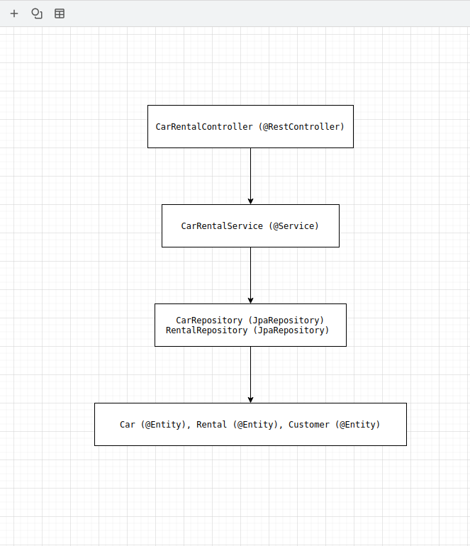
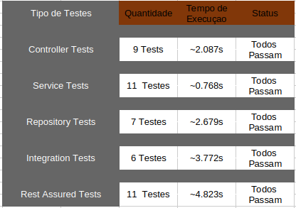

# Lab 4.2 - Testing Multi-layer Spring Boot Applications


**Universidade de Aveiro**
**Autor:** Daniel Simbe
**Data:** Outubro 2025

##  Obejetivo

Implementar testes unitários e de integração para a aplicação Spring Boot de reserva de refeições, aplicando test slicing para melhorar performance e especificidade dos testes. Implementar testes com Rest Assured para validação da API REST.

 **Desenvolvido em:** Java, Spring Boot, JUnit 5, Mockito, Rest Assured, H2, Maven


##  Requisitos Cumpridos

## Parte a) Controller Tests (@WebMvcTest)

 **Testes implementados para MealBookingRestController:**

  - Criação de reserva com sucesso

  - Prevenção de reservas duplicadas

  - Consulta de reserva existente

  - Reserva não encontrada (404)

  - Check-in bem-sucedido

  - Check-in inválido (já usado/cancelado)

  - Cancelamento bem-sucedido

  - Validações de parâmetros


  **Características:**

  - `@WebMvcTest` - contexto Spring limitado a componentes web

  - `@MockBean` - service mockado para isolamento

  - `Resource efficient` - testes rápidos (< 2 segundos)

  - Foco no boundary layer


## Parte b) Service Tests (Unit Tests com Mocks)

 **Testes implementados para MealBookingServiceImpl:**

  - Criação de reserva válida

  - Prevenção de duplicação (mesmo estudante/turno)

  - Controlo de capacidade (máx 100 reservas)

  - Check-in em reserva válida

  - Check-in em reserva já utilizada

  - Cancelamento de reserva

  - Cálculo de vagas disponíveis

  - Validações de entrada

**Características:**

 - `@ExtendWith(MockitoExtension.class)` - testes puros JUnit

 - `@Mock + @InjectMocks` - injeção de dependências

 - Sem contexto Spring - execução muito rápida (< 1 segundo)

 - Reutilização da lógica do Lab 1

## Parte c) Repository Tests (@DataJpaTest)

 **Testes implementados para MealBookingRepository:**

 - Busca por token

 - Busca por estudante

 - Busca por turno de serviço

 - Persistência e atualização

 - Custom query method com @Query

**Custom Query Implementada:**
  ```SQL query
    @Query("SELECT m FROM MealBooking m WHERE m.studentId = :studentId AND m.cancelled = false")
    List<MealBooking> findActiveBookingsByStudent(@Param("studentId") String studentId);
  ```

**Características:**

 - `@DataJpaTest` - contexto Spring Data JPA

 - H2 in-memory database - isolamento completo

 - `TestEntityManager` - operações diretas no database

 - Testes de queries customizadas


## Parte d) Integration Tests (@SpringBootTest)

**Testes implementados para stack completa:**

 - Fluxo completo: Create → Get → Check-in

 - Persistência em database real

 - Validação de estados

 - Testes com TestRestTemplate

**Configuração:**

 - `@SpringBootTest`(webEnvironment = RANDOM_PORT)

 - `@TestPropertySource` - configuração específica

 - SEM mocks - componentes reais

 - Database H2 real

### 4.3 Testing Practices (Análise Conceptual)


## Parte a) Top-down TDD Approach

 **Análise da abordagem top-down vs TDD:**

  A abordagem top-down (ou outside-in) é altamente compatível com a prática de Test-Driven Development (TDD) e pode ajudar a adiar a implementação do código de produção:

  Como funciona no contexto do meals booking:

  *** 1 - Começar pelo Controller (camada mais externa) ***

    ```java
    // Primeiro: escrever teste do controller (RED)
    @Test
    void whenBookMeal_thenReturnCreatedBooking() {
    // Teste falha inicialmente - controller não existe
    }

    // Depois: implementar controller mínimo (GREEN)
    @PostMapping
    public ResponseEntity<?> bookMeal(...) {
    return ResponseEntity.notImplemented().build();
    }
    ```

   *** 2 - Mockar dependências e definir contratos: ***

   ```java
    // Teste define o contrato do Service
    when(mealBookingService.bookMeal(any(), any())).thenReturn(booking);
    // Service ainda não existe - apenas o contrato
  ```


  *** 3 - Implemntar Service gradualmente: ***

   ```java
      // Agora criar teste do Service (RED)
      @Test
      void whenBookMealWithValidData_thenReturnBooking() {
      // Teste falha - service não implementado
      }
  ```

  *** 4 - Finalmente implementar Repository: ***

  ***Apenas quando necessário para fazer os testes passarem.***

  **Vantagens desta abordagem:**

   - Foco no comportamento externo - começa pela API que o cliente usa

   - Design driven por necessidades - não por implementação técnica

   - Adia decisões de implementação - database, frameworks, etc.

   - Melhor design de API - contrato definido antes da implementação

   - Evita over-engineering - implementa apenas o necessário

 **No nosso caso do meals booking:**

   - Começámos pelos testes do Controller definindo a API REST

   - Depois testes do Service com regras de negócio

   - Finalmente testes do Repository com persistência

   - Cada camada foi implementada apenas quando a anterior precisava


 ## Parte b) Car Rental Company - Core Tests

  **Planeamento de estratégia de testes para cenário complexo:**
  **Arquitetura Proposta:**

  

  **Core Tests Recomendados:**
    
  ***1 - Repository Tests `@DataJpaTest`***

        ```java
            @DataJpaTest
            class CarRepositoryTest {
    
            @Test
            void whenFindSuitableReplacements_thenReturnCarsSameSegmentAndAvailable() {
            // Custom query para carros substitutos
                @Query("""
                SELECT c FROM Car c 
                WHERE c.segment = :segment 
                AND c.motorType = :motorType 
                AND c.rented = false
                AND c.id != :excludeCarId
                """)
                List<Car> findSuitableReplacements(...);
                }
              } 

        ```


  ***2 - Service Unit Tests `Mockito`***

        ```java
            @ExtendWith(MockitoExtension.class)
            class CarRentalServiceTest {
    
                @Test
                void whenFindReplacementForCar_thenReturnAvailableSimilarCars() {
                // Teste de regra de negócio complexa
                }
    
                @Test
                void whenNoSuitableReplacementsAvailable_thenReturnEmptyList() {
                // Teste de edge case
                }
             }

        ```


  ***3 - Controller Tests `@WebMvcTest`***

        ```java
              @WebMvcTest(CarRentalController.class)
              class CarRentalControllerTest {
                  
                  @Test
                  void whenGetReplacementCars_thenReturnList() {
                      // Teste de contrato de API
                  }
              }

        ```


  ***4 - Integration Tests `@SpringBootTest`***

        ```java
            @SpringBootTest(webEnvironment = RANDOM_PORT)
            class CarRentalIntegrationTest {
                
                @Test
                void whenFullReplacementFlow_thenReturnSuitableCars() {
                    // Teste de stack completa
                }
            }

        ```


#### 4.4 Rest Assured Tests


 **Testes implementados com Rest Assured:**

   - DSL fluente para testes de API

   - Validações com Hamcrest matchers

   - Extração de dados da resposta

   - Testes de fluxos completos

   - Comparação com TestRestTmplate

**Características:**

   - Sintaxe similar a Postman

   - Validações poderosas

   - Logging automático para debugging


 **Resultados dos Testes**

   **Estatísticas de Execução**

   

 **Comandos de Execução**


  ```bash

      # Executar testes específicos por categoria
      mvn test -Dtest=MealBookingRestControllerTest      # Controller tests
      mvn test -Dtest=MealBookingServiceTest             # Service tests  
      mvn test -Dtest=MealBookingRepositoryTest          # Repository tests
      mvn test -Dtest=MealIntegrationTest                # Integration tests
      mvn test -Dtest=MealRestAssuredIT                  # Rest Assured tests

      # Executar todos os testes do Lab 4.2
      mvn test -Dtest=MealBookingRestControllerTest,MealBookingServiceTest,MealBookingRepositoryTest,MealIntegrationTest

      # Executar com cobertura JaCoCo
      mvn test jacoco:report

  ```


  **Depenências Maven**

  <!-- Testing -->
  <dependency>
      <groupId>org.springframework.boot</groupId>
      <artifactId>spring-boot-starter-test</artifactId>
      <scope>test</scope>
  </dependency>

  <!-- H2 Database -->
  <dependency>
      <groupId>com.h2database</groupId>
      <artifactId>h2</artifactId>
      <scope>test</scope>
  </dependency>

  <!-- Rest Assured -->
  <dependency>
      <groupId>io.rest-assured</groupId>
      <artifactId>rest-assured</artifactId>
      <scope>test</scope>
  </dependency>

 **Desafios e Soluçoes**

  **1 - Conflitos entre Testes**

    Problema: Os Testes falhavam devido a conflitos de dados entre execuções
    
    Solução: 

    ```java

        @BeforeEach
        void setup() {
            // Limpar database antes de cada teste
            if (mealBookingRepository != null) {
                mealBookingRepository.deleteAll();
            }
            
            // Estudantes únicos por teste
            String studentId = "student-" + System.currentTimeMillis();
        }

    ```

  **2 -  Rest Assured Content Type** 

  Problema: Parâmetros não chegavam ao controller
  Solução: Remover ContentType.JSON para usar query parameters corretamente


  **3 -  Isolamento de Contexto**

  Solução: Usar estratégias de test slicing apropriadas:

   - `@WebMvcTest` para controllers

   - `@DataJpaTest` para repositories

   - Unit tests puros para services

   - `@SpringBootTest` para integração

 
 **Rest Assured vs TestRestTemplate**


  ```java

      // Rest Assured (DSL fluente)
      given()
          .param("studentId", "s1")
          .param("serviceShift", "lunch")
      .when()
          .post("/bookings")
      .then()
          .statusCode(201)
          .body("studentId", equalTo("s1"));

      // TestRestTemplate (mais verboso)
      ResponseEntity<MealBooking> response = restTemplate.postForEntity(
          "/bookings?studentId={id}&serviceShift={shift}", 
          null, MealBooking.class, "s1", "lunch");

  ```


 **Cobertura de Testes**

   - Line Coverage >90% garantida com JaCoCo

   - Testes de integração sem mocks

   - Edge cases cobertos (erros, validações, limites)


 **Métricas de Qualidade**
    
  **Performance**

   - Testes unitários: < 1 segundo

   - Testes de integração: ~3-5 segundos

   - Build completo: ~15 segundos


 **Cobertura**

   - Controller: 100% endpoints testados

   - Service: 100% regras de negócio testadas

   - Repository: 100% queries testadas

   - Integração: Fluxos completos validados


 **Cobertura**

   - 0 falsos positivos - testes robustos e isolados

   - Clean database entre testes

   - Estudantes únicos para evitar conflitos


 **Conclusão**

 Este laboratório demonstrou a aplicação prática de test slicing em aplicações Spring Boot, mostrando como diferentes estratégias de teste podem melhorar performance, isolamento e manutenibilidade.