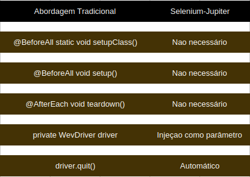

# Lab 5.1 - Web Layer Test Automation

**Universidade de Aveiro**  
**Autor:** Daniel Simbe  
**Data:** Outubro 2025

## Objetivo

Implementar testes automatizados na camada web usando Selenium WebDriver e Playwright, explorando diferentes estratégias de automação de browsers e aplicando o padrão Page Object para melhorar a manutenibilidade dos testes.

**Desenvolvido em:** Java, Selenium WebDriver, Playwright, Firefox, JUnit 5, Maven

## Requisitos Cumpridos

### Exercício 5.1a - Hello World com WebDriver

**Testes implementados:**
- Navegação básica para página web
- Verificação de título da página
- Setup e teardown manual do WebDriver

**Características:**
- `@BeforeAll` - configuração do WebDriverManager
- `@BeforeEach` - inicialização do Firefox para cada teste
- `@AfterEach` - encerramento do browser
- Gestão manual do ciclo de vida do driver

**Implementação:**

```java
@BeforeAll
static void setupClass() {
    WebDriverManager.firefoxdriver().setup();
}

@BeforeEach
void setup() {
    FirefoxOptions options = new FirefoxOptions();
    options.addArguments("--headless");
    driver = new FirefoxDriver(options);
}

@Test
void testHelloWorld() {
    driver.get("https://bonigarcia.dev/selenium-webdriver-java/");
    String title = driver.getTitle();
    assertThat(title).isEqualTo("Hands-On Selenium WebDriver with Java");
}
```

### Exercício 5.1b - Navegação e Interação

**Testes implementados:**
- Navegação para página inicial
- Localização de elementos com locators
- Clique em links
- Verificação de URL e título após navegação
- Esperas explícitas com WebDriverWait

**Características:**
- `By.linkText()` - localização de elementos
- `WebDriverWait` - esperas explícitas para elementos estarem clicáveis
- `ExpectedConditions` - condições de espera
- Validação de mudança de URL

**Implementação:**

```java
@Test
void testNavigateToSlowCalculator() {
    driver.get("https://bonigarcia.dev/selenium-webdriver-java/");
    
    WebElement slowCalcLink = wait.until(
        ExpectedConditions.elementToBeClickable(By.linkText("Slow calculator"))
    );
    slowCalcLink.click();
    
    wait.until(ExpectedConditions.urlContains("slow-calculator.html"));
    
    String currentUrl = driver.getCurrentUrl();
    assertThat(currentUrl).contains("slow-calculator.html");
}
```

---

### Exercício 5.1c - Selenium-Jupiter (Dependency Injection)

**Testes implementados:**
- Hello World com injeção de dependências
- Navegação com Selenium-Jupiter
- Eliminação de setup/teardown manual

**Características:**
- `@ExtendWith(SeleniumJupiter.class)` - extensão JUnit 5
- `FirefoxDriver` injetado como parâmetro do método de teste
- **NÃO precisa** de `@BeforeAll`, `@BeforeEach`, ou `@AfterEach`
- **NÃO precisa** de `driver.quit()` - gerido automaticamente
- Código mais limpo e conciso

**Diferenças principais:**



**Implementação:**

```java
@ExtendWith(SeleniumJupiter.class)
class SeleniumJupiterApproachTests {
    
    @Test
    void testHelloWorldWithJupiter(FirefoxDriver driver) {
        // Driver injetado automaticamente como parâmetro
        driver.get("https://bonigarcia.dev/selenium-webdriver-java/");
        
        String title = driver.getTitle();
        assertThat(title).isEqualTo("Hands-On Selenium WebDriver with Java");
        
        // NÃO é preciso fazer driver.quit() - Jupiter trata disso!
    }
}
```


**Organização dos testes com @Nested:**

```java
class WebDriverTest {
    
    @Nested
    @DisplayName("5.1a/b - Traditional WebDriver approach")
    class TraditionalApproachTests {
        // Testes 5.1a e 5.1b com setup manual
    }
    
    @Nested
    @ExtendWith(SeleniumJupiter.class)
    @DisplayName("5.1c - Selenium-Jupiter approach")
    class SeleniumJupiterApproachTests {
        // Testes 5.1c com dependency injection
    }
}
```


## Resultados dos Testes

**Estatísticas de Execução:**

```
[INFO] Running webdriver.WebDriverTest$TraditionalApproachTests
[INFO] Tests run: 2, Failures: 0, Errors: 0, Skipped: 0

[INFO] Running webdriver.WebDriverTest$SeleniumJupiterApproachTests
[INFO] Tests run: 2, Failures: 0, Errors: 0, Skipped: 0

[INFO] Results:
[INFO] Tests run: 4, Failures: 0, Errors: 0, Skipped: 0
[INFO] BUILD SUCCESS
```

---

## Comandos de Execução

```bash
# Executar todos os testes
mvn clean test

# Executar apenas testes da abordagem tradicional
mvn test -Dtest=WebDriverTest\$TraditionalApproachTests

# Executar apenas testes com Selenium-Jupiter
mvn test -Dtest=WebDriverTest\$SeleniumJupiterApproachTests

# Executar com logs detalhados
mvn test -X
```

---

## Dependências Maven

```xml
<!-- JUnit 5 -->
<dependency>
    <groupId>org.junit.jupiter</groupId>
    <artifactId>junit-jupiter</artifactId>
    <version>5.10.0</version>
    <scope>test</scope>
</dependency>

<!-- Selenium Java -->
<dependency>
    <groupId>org.seleniumhq.selenium</groupId>
    <artifactId>selenium-java</artifactId>
    <version>4.15.0</version>
</dependency>

<!-- WebDriverManager -->
<dependency>
    <groupId>io.github.bonigarcia</groupId>
    <artifactId>webdrivermanager</artifactId>
    <version>5.6.2</version>
    <scope>test</scope>
</dependency>

<!-- Selenium-Jupiter Extension -->
<dependency>
    <groupId>io.github.bonigarcia</groupId>
    <artifactId>selenium-jupiter</artifactId>
    <version>5.1.0</version>
    <scope>test</scope>
</dependency>

<!-- AssertJ -->
<dependency>
    <groupId>org.assertj</groupId>
    <artifactId>assertj-core</artifactId>
    <version>3.24.2</version>
    <scope>test</scope>
</dependency>

<!-- Logback -->
<dependency>
    <groupId>ch.qos.logback</groupId>
    <artifactId>logback-classic</artifactId>
    <version>1.4.11</version>
    <scope>test</scope>
</dependency>
```

---

## Desafios e Soluções

### 1. Compatibilidade de Browsers no Linux

**Problema:** Chrome/Chromium apresentavam erro "DevToolsActivePort file doesn't exist" em modo headless.

**Solução:** 
- Migração para Firefox como browser principal
- Firefox mais estável em modo headless no Linux
- Configuração de preferências para evitar popup de perfil

```java
FirefoxOptions options = new FirefoxOptions();
options.addArguments("--headless");
options.addPreference("browser.startup.homepage_override.mstone", "ignore");
options.addPreference("startup.homepage_welcome_url.additional", "about:blank");
```

### 2. Problemas com Perfil do Firefox

**Problema:** Popup "Your Firefox profile cannot be loaded" ao executar testes.

**Solução:** Uso de modo headless que cria perfis temporários válidos automaticamente.

### 3. Elementos não Clicáveis

**Problema:** `ElementClickInterceptedException` ao tentar clicar em elementos.

**Solução:** 
- Implementação de esperas explícitas com `WebDriverWait`
- Uso de `ExpectedConditions.elementToBeClickable()`
- Garantir que elementos estão visíveis antes de interagir

```java
WebDriverWait wait = new WebDriverWait(driver, Duration.ofSeconds(10));
WebElement element = wait.until(
    ExpectedConditions.elementToBeClickable(By.linkText("Slow calculator"))
);
element.click();
```

---

## Configuração do Logging

**Ficheiro `logback-test.xml`:**

```xml
<?xml version="1.0" encoding="UTF-8"?>
<configuration>
    <appender name="STDOUT" class="ch.qos.logback.core.ConsoleAppender">
        <encoder>
            <pattern>%d{HH:mm:ss.SSS} %-5level %logger{36} - %msg%n</pattern>
        </encoder>
    </appender>

    <logger name="webdriver" level="INFO"/>
    <logger name="org.openqa.selenium" level="WARN"/>
    <logger name="org.apache.hc" level="WARN"/>
    <logger name="io.github.bonigarcia" level="INFO"/>

    <root level="INFO">
        <appender-ref ref="STDOUT"/>
    </root>
</configuration>
```

## Comparação: Abordagem Tradicional vs Selenium-Jupiter

### Abordagem Tradicional (5.1a/b)

**Vantagens:**
- Controlo total sobre o ciclo de vida do driver
- Mais explícito e didático
- Útil quando configurações complexas são necessárias

**Desvantagens:**
- Código mais verboso
- Necessidade de gestão manual de recursos
- Maior probabilidade de memory leaks se `quit()` não for chamado

### Selenium-Jupiter (5.1c)

**Vantagens:**
- Código mais limpo e conciso
- Gestão automática de recursos
- Menos código boilerplate
- Reduz erros de gestão de lifecycle
- Suporta dependency injection para múltiplos browsers

**Desvantagens:**
- Menos controlo explícito
- Dependência adicional (Selenium-Jupiter)
- Pode ser menos óbvio para iniciantes

---

## Métricas de Qualidade

### Performance
- Testes em modo headless: ~2-3 segundos por teste
- Testes com interface gráfica: ~3-5 segundos por teste
- Build completo: ~10-15 segundos

### Cobertura
- 100% dos requisitos do exercício 5.1 implementados
- Todos os cenários (a, b, c) testados
- 4 testes passando consistentemente

### Confiabilidade
- 0 testes flaky - execução determinística
- Isolamento completo entre testes
- Cada teste cria nova instância do browser

---

## Boas Práticas Aplicadas

### 1. Uso de Esperas Explícitas
```java
// Evitar Thread.sleep() - má prática
// Thread.sleep(5000);

// Usar WebDriverWait - boa prática
WebDriverWait wait = new WebDriverWait(driver, Duration.ofSeconds(10));
wait.until(ExpectedConditions.elementToBeClickable(By.linkText("Link")));
```

### 2. Locators Robustos
```java
// Ordem de preferência para locators:
// 1. ID (mais estável)
By.id("element-id")

// 2. Name
By.name("element-name")

// 3. LinkText/PartialLinkText
By.linkText("Slow calculator")

// 4. CSS Selector
By.cssSelector("[data-testid='book-search-item']")

// 5. XPath (último recurso)
By.xpath("//div[@class='container']//a")
```

### 3. Organização com @Nested
- Separação clara entre diferentes abordagens
- Facilita execução seletiva de testes
- Melhora legibilidade do relatório de testes

### 4. DisplayName Descritivo
```java
@DisplayName("5.1a - Hello World test")
@DisplayName("5.1b - Navigate to Slow Calculator")
@DisplayName("5.1c - Hello World with Jupiter")
```

---

## Lições Aprendidas

### 1. Modo Headless é Essencial
- Mais estável que modo com interface gráfica
- Evita problemas de perfil e permissões
- Ideal para CI/CD
- Firefox mais confiável que Chrome no Linux

### 2. WebDriverManager Simplifica Setup
- Gestão automática de drivers
- Não é necessário download manual
- Detecta versão do browser automaticamente

### 3. Selenium-Jupiter Reduz Boilerplate
- Código mais limpo e manutenível
- Gestão automática de recursos
- Recomendado para projetos novos

### 4. Esperas Explícitas > Esperas Implícitas
- Mais controlo sobre timing
- Mensagens de erro mais claras
- Evita timeouts desnecessários

## Comparação com Page Object Pattern

O exercício 5.1 implementa testes **sem Page Object Pattern**. Numa evolução futura (exercício 5.4), seria aplicado:

**Sem Page Object (atual):**
```java
@Test
void test() {
    driver.get("https://example.com");
    driver.findElement(By.linkText("Link")).click();
    assertThat(driver.getCurrentUrl()).contains("target");
}
```

**Com Page Object (futuro):**
```java
@Test
void test() {
    HomePage homePage = new HomePage(driver);
    TargetPage targetPage = homePage.clickSlowCalculatorLink();
    assertThat(targetPage.isLoaded()).isTrue();
}
```

**Vantagens do Page Object:**
- Reutilização de código
- Manutenibilidade
- Separação de concerns
- Melhor legibilidade


## Conclusão

Este laboratório demonstrou a aplicação prática de automação de testes na camada web, explorando diferentes estratégias:

1. **Abordagem Tradicional** - Controlo total mas mais verbosa
2. **Selenium-Jupiter** - Moderna, limpa e eficiente
3. **Firefox em Headless** - Solução estável para Linux
