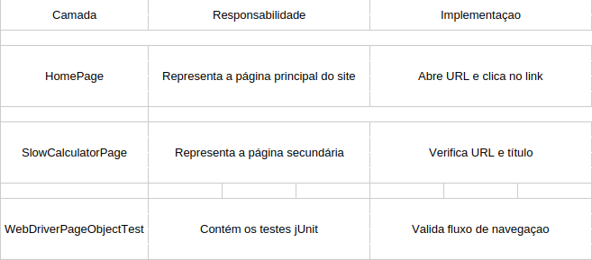

# Lab 5.4 - Page Object Pattern com Selenium WebDriver

**Universidade de Aveiro**  
**Autor:** Daniel Simbe  
**Data:** Outubro 2025

## Objetivo

Aplicar o Page Object Pattern (POP) para estruturar testes web em Selenium, separando a lógica de automação (Page Objects) da lógica de validação (Testes).
O objetivo é aumentar a reutilização de código, clareza e manutenibilidade dos testes automatizados

**Conceito: Page Object Pattern**

O Page Object Pattern é um padrão de design para testes automatizados que encapsula a interação com elementos de uma página web numa classe Java dedicada.
Cada página ou componente da aplicação web é representado por uma classe que:

 - Define locators (`By.id, By.linkText`, etc.)

 - Implementa métodos de interação (click, input, submit…)

 - Expõe métodos de alto nível para os testes utilizarem

## Estratégia de Teste

## Vantagens do Page Object Pattern

 - Reutilização de código: Classes de páginas podem ser usadas por múltiplos testes
 - Separação de responsabilidades: Testes focam em lógica de negócio, não em detalhes técnicos
 - Facilidade de manutenção: Mudanças no HTML afetam apenas a Page class correspondente
 - Maior legibilidade: Testes tornam-se quase legíveis em linguagem natural

## Conclusão

Este exercício consolidou o uso do Selenium WebDriver com o Page Object Pattern, mostrando como estruturar testes de forma mais profissional e sustentável.
Agora, os testes estão modulares, reutilizáveis e fáceis de expandir, prontos para escalar em aplicações web mais complexas.